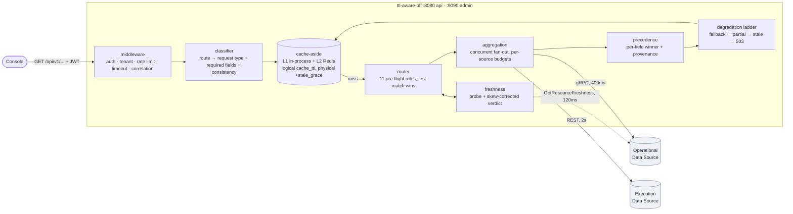

# ttl-aware-bff

A Backend for Frontend over two data sources with incompatible performance
profiles: an **Operational Data Source** (gRPC, current resource state,
millisecond reads) and an **Execution Data Source** (REST, workflow history and
audit, structurally slower, and holder of data the operational source does not
have). Fanning out to both on every request makes every response as slow as the
slower source; reading only the fast one makes some answers wrong. The core idea
is to make *how old the operational copy is* an explicit, configured, per-request-type
input to routing: a cheap freshness probe decides whether the operational record
is inside its TTL, and an ordered chain of eleven named rules turns that verdict —
together with source health, the fields the endpoint actually needs and the
caller's consistency requirement — into a routing decision that the response then
publishes, so every answer can be explained by the id of the rule that produced it.



Full diagrams and the reasoning behind each one: **[docs/architecture.md](docs/architecture.md)**.
Operational procedures: **[docs/runbook.md](docs/runbook.md)**. Frozen names, ports
and keys: **[docs/DESIGN-CONTRACT.md](docs/DESIGN-CONTRACT.md)**.

---

## Quick start

```bash
make compose-up
```

That builds and starts the BFF, both reference data sources, Redis, an OTel
collector, Jaeger, Prometheus and Grafana, and waits for their health checks.

| Surface | URL |
|---|---|
| API | http://localhost:8080/api/v1 |
| Admin (probes, metrics, effective routing config) | http://localhost:9090 |
| Operational source chaos API | http://localhost:9111 |
| Execution source chaos API | http://localhost:9112 |
| Traces | http://localhost:16686 |
| Prometheus | http://localhost:9091 |
| Grafana (admin/admin) | http://localhost:3000 |

The stack runs with `security.allow_insecure_no_auth: true`, which configuration
validation permits only when `observability.environment` is `local` or `test`. In
that mode the tenant comes from the `X-Tenant-ID` header and defaults to `local`,
so no identity provider is needed.

The operational source seeds fifty resources, `R001`..`R050`. Two properties of the
seed matter for everything below:

- **Tenant.** `R00i` belongs to `acme` when `i % 3 == 0`, to `local` when
  `i % 3 == 1`, and to `globex` otherwise. Asking for another tenant's resource
  returns `404`, because the source enforces isolation itself.
- **Age.** `R00i`'s operational record is always `(i % 7) * 5` seconds old — an
  offset, not a timestamp, so it does not drift while the stack is up. `R007` is
  always fresh; `R013` is always 30 seconds old.

### A fresh response — TTL hit

`resource_status` has `ttl: 10s`, and `R007`'s record is 0 seconds old.

```bash
curl -s http://localhost:8080/api/v1/resources/R007/status \
  -H 'X-Tenant-ID: local' | jq
```

```jsonc
{
  "data": {
    "tenantId": "local",
    "resourceId": "R007",
    "status": "ACTIVE",
    "subState": "reconciling",
    "observedAt": "2026-09-03T09:14:22.118Z"
  },
  "meta": {
    "correlationId": "01J...",
    "routingDecision": "OPERATIONAL",
    "routingRule": "ttl.operational.fresh",
    "sources": ["OPERATIONAL"],
    "freshness": {
      "state": "FRESH",
      "observedAt": "2026-09-03T09:14:22.118Z",
      "evaluatedAt": "2026-09-03T09:14:22.402Z",
      "source": "OPERATIONAL",
      "version": 7,
      "ageSeconds": 0.284,
      "ttlSeconds": 10
    },
    "degraded": false,
    "partial": false,
    "cache": { "hit": false, "layer": "NONE" },
    "elapsedMs": 6
  }
}
```

The execution source was not contacted at all. Repeat the command within
`cache_ttl: 3s` and `meta.cache` becomes `{"hit": true, "layer": "L2", "ageMs": 900}` —
`L2` because the compose stack sets `BFF_CACHE__BACKEND=redis`.

### A TTL miss

`R013`'s record is 30 seconds old against a 10 second TTL, and `resource_status`
has `fallback: execution`.

```bash
curl -s http://localhost:8080/api/v1/resources/R013/status \
  -H 'X-Tenant-ID: local' | jq '.meta'
```

```jsonc
{
  "routingDecision": "EXECUTION",
  "routingRule": "ttl.operational.stale",
  "sources": ["EXECUTION"],
  "freshness": { "state": "UNKNOWN", "evaluatedAt": "...", "source": "EXECUTION", "ageSeconds": 0, "ttlSeconds": 10 },
  "degraded": false,
  "partial": false,
  "cache": { "hit": false, "layer": "NONE" }
}
```

A *current* answer from the slow source beat a *stale* answer from the fast one.
Freshness is `UNKNOWN` rather than `FRESH`: only the operational source publishes a
freshness envelope, and an execution-sourced answer does not borrow its verdict.
`ageSeconds` is `0` there rather than absent — the envelope always carries both
numbers, and `state: UNKNOWN` is what tells a client the age means nothing.

### A fan-out

`resource_details` is the only request type whose required fields span both
sources, so it is the only one that fans out.

```bash
curl -s http://localhost:8080/api/v1/resources/R007/details \
  -H 'X-Tenant-ID: local' | jq '{status: .data.status, meta: .meta}'
```

```jsonc
{
  "status": "ACTIVE",
  "meta": {
    "routingDecision": "BOTH",
    "routingRule": "fields.span_both",
    "sources": ["OPERATIONAL", "EXECUTION"],
    "freshness": { "state": "FRESH", "source": "OPERATIONAL", "ageSeconds": 0.31, "ttlSeconds": 30 },
    "degraded": false,
    "partial": false,
    "provenance": {
      "status": "OPERATIONAL", "configuration": "OPERATIONAL", "metrics": "OPERATIONAL",
      "topology": "OPERATIONAL", "owner": "OPERATIONAL", "labels": "OPERATIONAL",
      "latestExecution": "EXECUTION", "executionHistory": "EXECUTION"
    },
    "elapsedMs": 168
  }
}
```

Three calls went out concurrently — one to the operational source with a 400ms
budget, two to the execution source with 1500ms budgets — and the elapsed time is
the slowest branch, not their sum.

### The envelope, field by field

Every `2xx` body is `{"data": ..., "meta": ...}`. `data` is the endpoint's payload;
`meta` is the audit record of how it was obtained.

| Field | Meaning |
|---|---|
| `meta.correlationId` | Echoes `X-Correlation-ID` if supplied, otherwise generated. Also returned as a header. |
| `meta.routingDecision` | Which source set answered: `OPERATIONAL`, `EXECUTION`, `BOTH`, `NONE`. |
| `meta.routingRule` | *Which named rule decided it.* One of the eleven pre-flight ids, the pre-chain guard `guard.unconfigured_request_type`, or the two the application layer stamps: `fallback.primary_failed` and `degrade.stale_cache`. |
| `meta.sources` | The sources that actually contributed. Includes `CACHE` on a cache hit. |
| `meta.freshness.state` | `FRESH`, `STALE` or `UNKNOWN`, evaluated against this request type's `ttl`. |
| `meta.freshness.ageSeconds` | How old the observation is, in seconds, skew-corrected. Always present; `0` alongside `state: UNKNOWN` means "no age could be established", not "brand new". |
| `meta.freshness.ttlSeconds` | The freshness TTL that produced `state`, after any tenant overlay. Always present. |
| `meta.freshness.observedAt` | When the source last refreshed the record, in the source's own clock. |
| `meta.freshness.evaluatedAt` | When the BFF made the judgement. |
| `meta.freshness.source` | Whose freshness this is. Only `OPERATIONAL` carries a meaningful TTL. |
| `meta.freshness.skewCorrected` | The source's clock disagreed with the BFF's and the age was corrected. |
| `meta.freshness.version` | The source's monotonic record version, when it publishes one. |
| `meta.degraded` | The data is whole but older than intended, or came from a fallback source. Also sent as `X-BFF-Degraded: true`. |
| `meta.partial` | A source the request wanted did not answer, **or** the source that did cannot hold every requested field. Always HTTP `206` and a warning. |
| `meta.cache.hit` / `.layer` / `.ageMs` | Whether the cache answered, from `L1` or `L2`, and how long the entry had been resident. Always `false` for a strongly-consistent request: those bypass the cache **read** and are only ever written back. |
| `meta.provenance` | Per field, which source won. This is where a precedence decision becomes visible. |
| `meta.warnings[]` | `{code, message, source}`. Codes: `STALE_DATA`, `PARTIAL_DATA`, `SOURCE_UNAVAILABLE`, `SOURCE_TIMEOUT`, `CONFLICT_RESOLVED`, `CLOCK_SKEW_DETECTED`, `SCHEMA_VERSION_MISMATCH`, `CACHE_UNAVAILABLE`. |
| `meta.elapsedMs` | Server-side wall time. |

Errors use a separate, RFC 7807-shaped document — `{"error": {code, type, title,
status, detail, correlationId, retryable, sources}}` — where `sources` names each
source's state (`HEALTHY`, `CIRCUIT_OPEN`, `CIRCUIT_HALF_OPEN`, `SATURATED`) at the
time of the failure.

Three response headers carry the same facts for anyone reading an access log:
`X-BFF-Freshness`, `X-BFF-Source`, and `X-BFF-Degraded` when degraded.

---

## Seeing the routing work

The two reference sources expose chaos APIs on their admin ports specifically so
these behaviours can be produced on demand rather than described. Nothing below
requires restarting or patching anything.

```bash
# Reset both sources to their defaults at any point
curl -sX DELETE http://localhost:9111/chaos
curl -sX DELETE http://localhost:9112/chaos
```

A useful shorthand for the rest of this section:

```bash
rule() { curl -s "http://localhost:8080/api/v1$1" -H 'X-Tenant-ID: local' \
  | jq -c '{rule: .meta.routingRule, target: .meta.routingDecision,
            fresh: .meta.freshness.state, degraded: .meta.degraded,
            partial: .meta.partial, cache: .meta.cache.hit,
            warn: [.meta.warnings[]?.code]}'; }
```

### 1. Turn a TTL hit into a TTL miss

```bash
rule /resources/R007/status
# {"rule":"ttl.operational.fresh","target":"OPERATIONAL","fresh":"FRESH",...}

# Age R007's operational record past the 10s TTL for resource_status
curl -sX POST 'http://localhost:9111/resources/R007/age?seconds=60'
# {"resourceId":"R007","age_seconds":60}

sleep 4      # wait out cache_ttl: 3s, or you will just get the cached answer
rule /resources/R007/status
# {"rule":"ttl.operational.stale","target":"EXECUTION","fresh":"UNKNOWN",...}

# Refresh it and the route snaps back
curl -sX POST http://localhost:9111/resources/R007/touch
sleep 4
rule /resources/R007/status
# {"rule":"ttl.operational.fresh","target":"OPERATIONAL","fresh":"FRESH",...}
```

Watch it as a metric while you do it:

```bash
curl -s http://localhost:9090/metrics | grep -E 'operational_ttl_(hit|miss)_total|execution_fallback_total'
```

### 2. An operational outage, and both kinds of fallback

This is the most instructive one, because the *rule id changes as the breaker
learns*. Take the operational source down and issue thirty requests:

```bash
curl -sX PUT http://localhost:9111/chaos -H 'content-type: application/json' \
  -d '{"unavailable": true}'

# (i % 17) * 3 + 1 walks R001, R004, ... R049 — every resource that belongs
# to tenant local, so nothing in the loop 404s on tenant isolation.
for i in $(seq 0 29); do
  id=$(printf 'R%03d' $(( (i % 17) * 3 + 1 )))
  curl -s "http://localhost:8080/api/v1/resources/$id/status" \
    -H 'X-Tenant-ID: local' | jq -r '.meta.routingRule // .error.code'
done | sort | uniq -c
```

Early responses come back as `fallback.primary_failed`: the breaker was still
closed, so the router picked the operational source, the call failed, and the
application layer retried against the configured fallback at call time. Once the
failure ratio crosses `0.5` over `minimum_requests: 20` in the 30 second window,
the breaker opens and later responses come back as `health.primary_unavailable` —
the router now avoids the source pre-flight and no doomed call is issued at all.

Both rungs mark the answer `"degraded": true` and attach a `SOURCE_UNAVAILABLE`
warning naming the source that answered instead. That is deliberate for the
routing-time rung as well as the call-time one: the answer did not come from the
source the request type prefers, and a UI showing a freshness badge deserves to
know. Because the response is degraded it also picks up a `STALE_DATA` warning,
which is how the service labels every degraded answer.

```bash
curl -s http://localhost:9090/metrics | grep -E 'circuit_breaker_state|circuit_breaker_transition_total'
curl -s http://localhost:9090/readyz | jq            # reports both sources' state
curl -sX DELETE http://localhost:9111/chaos          # restore
```

### 3. A partial response

Take the execution source down. `resource_details` declares
`required_sources: {operational: true, execution: false}`, so the execution branch
is allowed to fail.

```bash
curl -sX PUT http://localhost:9112/chaos -H 'content-type: application/json' \
  -d '{"unavailable": true}'

curl -s -o /tmp/details.json -w '%{http_code}\n' \
  http://localhost:8080/api/v1/resources/R007/details -H 'X-Tenant-ID: local'
# 206

jq -c '{partial: .meta.partial, sources: .meta.sources,
        warn: [.meta.warnings[].code]}' /tmp/details.json
# {"partial":true,"sources":["OPERATIONAL"],"warn":["SOURCE_UNAVAILABLE"]}
```

`206` rather than `200`, so a cache or a dashboard can tell the difference without
parsing the body. Contrast with an execution-only endpoint, which has no
operational substitute and therefore fails outright:

```bash
curl -s -w '\n%{http_code}\n' \
  http://localhost:8080/api/v1/resources/R007/executions -H 'X-Tenant-ID: local'
# 503, error.code = UPSTREAM_UNAVAILABLE

curl -sX DELETE http://localhost:9112/chaos
```

Or make it slow rather than dead, and watch the same endpoint degrade on a timeout
instead: the warning becomes `SOURCE_TIMEOUT`, because
`per_source_timeout.execution` is 1500ms.

```bash
curl -sX PUT http://localhost:9112/chaos -H 'content-type: application/json' \
  -d '{"base_latency_ms": 2500, "jitter_ms": 0}'
```

### 4. A stale, degraded serve

Prime the cache, then take **both** sources down and wait out the logical cache
TTL. The entry is physically retained for `cache_ttl + cache.stale_grace` (3s + 5m),
so it is still reachable — but only by the stale path.

```bash
curl -sX DELETE http://localhost:9111/chaos; curl -sX DELETE http://localhost:9112/chaos
curl -s -o /dev/null http://localhost:8080/api/v1/resources/R007/status -H 'X-Tenant-ID: local'

curl -sX PUT http://localhost:9111/chaos -H 'content-type: application/json' -d '{"unavailable": true}'
curl -sX PUT http://localhost:9112/chaos -H 'content-type: application/json' -d '{"unavailable": true}'

sleep 5
rule /resources/R007/status
# {"rule":"degrade.stale_cache","target":"NONE","degraded":true,"cache":true,"warn":["STALE_DATA"]}
```

HTTP `200`, clearly labelled. Now do the identical thing as tenant `globex`, which
overrides `resource_status.allow_stale: false`:

```bash
curl -s -o /dev/null -w '%{http_code}\n' \
  http://localhost:8080/api/v1/resources/R002/status -H 'X-Tenant-ID: globex'
# 503 — NO_SOURCE_AVAILABLE
```

Same code, same cache state, different answer, because "prefer correctness over
latency" is four lines of YAML rather than a code path. Restore with the two
`DELETE /chaos` calls.

### 5. A running workflow overriding operational state

The operational source marks `R00i` as having an in-flight execution when
`i % 5 == 1`, and seeds the reference to an execution the execution source really
does report as running. `R001` is both `local` and in-flight.

```bash
curl -s http://localhost:8080/api/v1/resources/R001/status -H 'X-Tenant-ID: local' \
  | jq -c '{sources: .meta.sources, provenance: .meta.provenance, rule: .meta.routingRule}'
```

`/status` is an operational-only read, but `routing.defaults.resolve_in_flight_execution`
makes the BFF fetch that one execution (budget: `in_flight_lookup_timeout: 300ms`)
so the precedence rule `execution_overrides_when_running: [status, subState]` can
fire. Without it, `/status` and `/details` would report different statuses for the
same resource mid-workflow. It is best-effort: if the lookup fails, the operational
answer stands unchanged.

The marker alone is not enough to move `status`. The override needs an execution
candidate the execution source still reports as `RUNNING`; an
`in_flight_execution_ref` left behind by a workflow that has since finished is
reported (in `data.inFlightExecutionId`) but confers no authority, so a completed
run's *predicted* status can never outrank the operational source's *observed*
one.

You can create the situation on any resource:

```bash
curl -sX POST 'http://localhost:9112/resources/R007/executions?state=IN_PROGRESS&tenantId=local' | jq -r .executionId
curl -sX POST 'http://localhost:9111/resources/R007/in-flight?executionId=<that id>'
```

### The chaos surface, in full

**Operational source — `:9111`**

| Endpoint | Effect |
|---|---|
| `GET /chaos` | Current knob values |
| `PUT /chaos` | Any subset of `latency_min_ms`, `latency_max_ms`, `failure_rate`, `unavailable`, `probe_unavailable`, `stale_by_seconds`, `clock_skew_seconds`, `partial`, `schema_version` |
| `DELETE /chaos` | Reset |
| `POST /resources/{id}/age?seconds=N` | Add N seconds to that record's age |
| `POST /resources/{id}/touch` | Set that record's age to 0 and bump its version |
| `POST /resources/{id}/in-flight?executionId=E` | Set the in-flight execution reference |
| `GET /resources` | List seeded ids |
| `GET /healthz`, `GET /livez`, `GET /readyz` | The same three probes the BFF serves, so the compose health-check and the Kubernetes manifests can target `/readyz` on the stubs too |

`probe_unavailable` is the interesting one: it fails only the freshness probe, so
the verdict becomes `UNKNOWN` and rule 10 applies `on_unknown_freshness` while
ordinary reads keep working. `clock_skew_seconds` shifts the source's reported
`server_time` and exercises skew correction.

**Execution source — `:9112`**

| Endpoint | Effect |
|---|---|
| `GET /chaos` | Current knob values |
| `PUT /chaos` | Any subset of `base_latency_ms`, `jitter_ms`, `failure_rate`, `unavailable`, `malformed`, `schema_version` |
| `DELETE /chaos` | Reset to 120ms base / 60ms jitter |
| `POST /resources/{id}/executions?operation=&state=&resultingState=&tenantId=` | Insert a new execution, newest-first |
| `GET /healthz`, `GET /livez`, `GET /readyz` | The same three probes the BFF serves |

---

## Repository layout

| Path | Contents |
|---|---|
| `cmd/bff` | The service binary: configuration load, wiring, signal handling, graceful shutdown. |
| `cmd/opsource` | Reference Operational Data Source (gRPC `:9101`, chaos admin `:9111`). |
| `cmd/exsource` | Reference Execution Data Source (REST `:9102`, chaos admin `:9112`). |
| `internal/api` | HTTP server, route table, admin listener; `handler/`, `middleware/`, `response/` beneath it. |
| `internal/application` | The request lifecycle. The only package where router, cache, adapters, aggregator and precedence meet. |
| `internal/classifier` | Route → request type, required fields, consistency level. Knows the API, not the sources. |
| `internal/domain` | The canonical model. No source types, no transport types, no internal imports. |
| `internal/router` | The eleven-rule decision chain. A pure function of a value struct. |
| `internal/policy` | Source precedence policy and the field catalogue that makes rules 3–5 decidable. |
| `internal/freshness` | Probe management, memoisation of observations, clock-skew-corrected verdicts. |
| `internal/datasource` | Port interfaces plus `operational/` (gRPC) and `execution/` (REST) adapters. |
| `internal/mapper` | Source schemas → canonical model. Neither source uses the canonical vocabulary. |
| `internal/aggregation` | Concurrent fan-out with per-source budgets, required/optional semantics, and the merge. |
| `internal/cache` | Cache-aside manager, in-process L1, Redis L2, layered composition, singleflight, negative caching. |
| `internal/resilience` | Timeout, bounded retry, circuit breaker, bulkhead, rate limiter. Mechanism only, no policy. |
| `internal/observability` | OTel tracer/meter providers, the metric instruments, structured logging, redaction. |
| `internal/security` | JWT verification, JWKS, RBAC, tenant resolution. |
| `internal/config` | Layered configuration: file → environment → tenant overlay, with validation and hot reload. |
| `internal/testutil` | Assertions, fakes, deterministic clocks. |
| `pkg/errs` | The typed error taxonomy shared by adapters and the API error model. |
| `pkg/correlation` | Correlation-id and tenant propagation through `context`. |
| `api/openapi`, `api/proto` | The published API contract and the ODS protobuf definition. |
| `configs` | `bff.yaml` — the only place a TTL, timeout or threshold has a value. |
| `spec` | Requirements, routing policy, data contracts, error model, security, observability, testing. |
| `docs` | Design contract, architecture, runbook, `diagrams/`. |
| `deploy/docker` | Dockerfiles and the local collector/Prometheus/Grafana configuration. |
| `deploy/k8s` | Kustomize base and `dev`/`prod` overlays. |
| `deploy/helm/ttl-aware-bff` | The Helm chart, with `values`, `values-dev`, `values-prod`. |
| `deploy/terraform` | VPC, EKS, ElastiCache, ALB, IAM/IRSA and observability modules. |
| `test/integration` | Lifecycle and the twenty mandated edge cases, driven through the chaos APIs. |
| `test/contract` | Source-contract and API-contract tests. |
| `test/load` | k6 profiles: smoke, load, stress, spike, soak, degradation. |
| `scripts` | `gen-proto.sh`. |

---

## Configuration

`configs/bff.yaml` is the only place a TTL, timeout, threshold or precedence rule
has a value; nothing under `internal/` compiles one in. Every key is overridable by
environment variable using the `BFF_` prefix and `__` as the nesting separator:

```bash
BFF_ROUTING__REQUEST_TYPES__RESOURCE_STATUS__TTL=5s
BFF_SOURCES__OPERATIONAL__ADDR=ods.internal:9101
BFF_CACHE__BACKEND=layered
```

The file is re-read while the service runs (`--config-watch`, default 15s). A
reload that fails validation is rejected and the previous configuration stays in
force; `GET :9090/config/routing` reports `reload_count` and `reload_failures`.

### The two TTLs

This is the distinction the whole service is built on, and conflating them is the
most likely way to break it.

| | `routing.request_types.<t>.ttl` | `routing.request_types.<t>.cache_ttl` |
|---|---|---|
| Name | **Source freshness TTL** | **BFF response cache TTL** |
| Question it answers | How old may the *operational source's observation* be and still count as current for this kind of request? | How long may the BFF reuse *its own computed answer*? |
| Owned by | routing | the cache |
| Drives | the routing decision — rules 8, 9 and 10 | nothing but cache lookups |
| Compared against | `server_time − last_updated` from the source's freshness envelope | how long the entry has been resident |
| Effect of raising it | The BFF tolerates older source data and calls the slow source less | The BFF recomputes less and serves its own older answers more |

`cache_ttl` is smaller than `ttl` for every request type, and validation refuses
the reverse: a cache entry must expire before the data inside it goes stale,
otherwise a cache hit would routinely serve data whose freshness verdict has
already flipped. Even so, a cache hit is **always** re-evaluated — the stored
freshness is re-reported with the accumulated cache age added, so a cache hit can
legitimately report `STALE` and set `degraded: true`. The cache is never permitted
to assert freshness on its own authority.

A third lifetime sits behind both: `cache.stale_grace` (5m) is how long an entry is
*physically* retained past its logical `cache_ttl`, so it remains reachable by the
stale-serve path when every source is down. Only `Manager.GetStale` can see it; no
ordinary read path can reach expired data by accident.

### The shipped routing table

| Request type | `preferred_source` | `ttl` | `cache_ttl` | `fallback` | `allow_stale` | `max_stale` | `consistency` |
|---|---|---|---|---|---|---|---|
| `resource_status` | operational | 10s | 3s | execution | true | 120s | bounded |
| `resource_configuration` | operational | 30s | 15s | none | true | 300s | eventual |
| `resource_read` | operational | 30s | 5s | execution | true | 300s | bounded |
| `execution_status` | execution | 5s | 2s | none | false | — | strong |
| `execution_history` | execution | 0s | 0s | none | false | — | strong |
| `resource_details` | both | 30s | 5s | operational | true | 300s | bounded |

Read as policy statements: `resource_status` has the shortest TTL because status is
the field users watch change, and a fallback because a live execution view of
status beats nothing. `resource_configuration` has `fallback: none` because the
execution source structurally cannot supply configuration — a fallback there would
be a lie, not a degradation. `execution_history` is `ttl: 0` / `cache_ttl: 0`,
always live. `execution_status` forbids stale answers because telling a user a run
is still going when it finished is actively dangerous. `resource_details` makes the
execution side optional so the heavy endpoint degrades to a fast operational-only
answer rather than inheriting the execution source's latency as a hard dependency.

### Tenant overlays

Anything omitted from a tenant block falls through to the values above.

| Tenant | Override | Effect |
|---|---|---|
| `acme` | `resource_status`: `ttl: 5s`, `cache_ttl: 2s`, `max_stale: 60s`; rate limit 500/1000 | A faster-refreshing source affords a tighter TTL |
| `globex` | `resource_status`: `ttl: 15s`, `cache_ttl: 5s`, `max_stale: 15s`, `allow_stale: false` | Correctness over latency: `503` where another tenant gets a degraded `200` |
| everyone else | — | The defaults |

Ask a running pod what it is actually using:

```bash
curl -s 'http://localhost:9090/config/routing?tenant=globex' | jq '.request_types.resource_status'
```

### Other keys worth knowing

| Key | Default | Why it is that value |
|---|---|---|
| `sources.operational.call_timeout` | `400ms` | This source is supposed to be fast; a slow answer from it is a signal, not something to wait out |
| `sources.operational.freshness_probe_timeout` | `120ms` | Must be strictly less than `call_timeout`, or TTL routing costs more than it saves |
| `sources.execution.call_timeout` | `2s` | Five times the operational budget, because this source genuinely is slower |
| `sources.execution.bulkhead.max_concurrent` | `64` | A quarter of the operational allowance; this is the number that stops a slow execution source consuming the whole BFF |
| `routing.defaults.on_unknown_freshness` | `operational` | An unknown verdict usually means "the probe was slow", not "the data is old". `none` is honoured — an operator who wrote it chose to fail rather than guess, and gets `503 NO_SOURCE_AVAILABLE`; only an *unparseable* value silently falls back to `operational` |
| `routing.defaults.clock_skew_tolerance` | `2s` | Fallback age arithmetic is biased toward "older" by this much, never toward "fresher" |
| `routing.defaults.probe_cache_ttl` | `1s` | Bounds how often the BFF re-asks "how old is this?". A cache TTL, not a freshness TTL: a reused probe result is aged by the time it spent in the memo, so it can never make a record look fresher than it is |
| `routing.defaults.resolve_in_flight_execution` | `true` | Keeps `/status` and `/details` from disagreeing mid-workflow: an operational-only read consults the execution source when the operational record declares an `in_flight_execution_ref`. It is a `*bool`, so a tenant can turn it off on its own without also having to set a companion duration |
| `routing.defaults.in_flight_lookup_timeout` | `300ms` | The budget for that extra call. Best-effort — a failure leaves the operational answer standing |
| `cache.negative_ttl` | `3s` | A UI polling a missing resource must not hammer both sources; also caps how long a **degraded or partial** answer is cached, so neither outlives the incident that produced it |
| `cache.stale_grace` | `5m` | How long an entry is *physically* retained past its logical `cache_ttl` so the stale-serve path can still reach it. Only `Manager.GetStale` can see it |
| `cache.fail_open` | `true` | A cache failure must never fail a request |
| `cache.stampede.early_refresh_ratio` | `0.8` | Refresh in the background at 80% of an entry's life, so the expiry cliff does not land on a user's request. The refresh keeps the request context's *values* (tenant, correlation id) while dropping its cancellation, is bounded by a fixed 10s budget rather than by the cache TTL, will not overwrite an entry a foreground load stored while it was in flight, and reports failures through `cache_error_total` |
| `server.request_timeout` | `8s` | Exceeds the slowest per-source budget plus mapping, and stays comfortably under the ALB idle timeout |
| `server.shutdown_grace` | `25s` | `preStop` 10s + 25s < `terminationGracePeriodSeconds` 45s |

---

## Tests

| Tier | Command | What it covers |
|---|---|---|
| Unit | `make test` | Every package. The router's tests are truth tables; no HTTP, no gRPC, no clocks. |
| Unit, race | `make test-race` | `-race -shuffle=on`, which also catches order-dependent tests. |
| Coverage gate | `make cover` | Enforces `COVERAGE_THRESHOLD` (75%) and writes `coverage.html`. |
| Integration | `make test-integration` | Brings up the compose stack and drives the twenty mandated edge cases through the chaos APIs. |
| Contract | `make test-contract` | Both source contracts and the published API contract. |
| Load | `make k6-load` | The k6 profiles in `test/load` — see [`test/load/README.md`](test/load/README.md). |
| Everything CI runs | `make ci` | `fmt vet lint test-race cover vuln`. |

Point a load profile at a deployed environment with
`make k6-load K6_BASE_URL=https://bff.dev.example.com K6_SCRIPT=test/load/smoke.js`.

Static analysis: `make lint` (golangci-lint), `make vet`, `make vuln`
(govulncheck), `make fmt`.

---

## Build and deploy

```bash
make build          # three static binaries into ./bin
make docker-build   # three images at $(REGISTRY)/<name>:$(IMAGE_TAG)
```

Images are `ghcr.io/udaykishore/ttl-aware-bff`, `-opsource` and `-exsource`.
Version, commit and build date are injected via `-ldflags` identically by the
Makefile and the Dockerfiles, so a locally built binary reports the same version
string as the containerised one, and `GET :9090/buildinfo` returns it.

```bash
# Kubernetes — Helm
make helm-lint
make helm-template                  # renders all three values files and parses the YAML
helm upgrade --install ttl-aware-bff deploy/helm/ttl-aware-bff \
  --namespace bff --create-namespace --values deploy/helm/ttl-aware-bff/values-prod.yaml

# Kubernetes — Kustomize
make kustomize-build                # renders base + dev + prod overlays
kubectl apply -k deploy/k8s/overlays/prod

# Infrastructure
make tf-fmt tf-validate
terraform -chdir=deploy/terraform apply
```

The Terraform stack provisions the VPC, EKS cluster, ElastiCache replication group,
ALB, IAM/IRSA roles and the observability wiring. The workload manifests provision
the Deployment (3 replicas), Service, Ingress (ALB annotations), HPA (3–30 pods at
70% CPU), PodDisruptionBudget, NetworkPolicy and ServiceMonitor in namespace `bff`.

---

## Observability

| Endpoint | Purpose |
|---|---|
| `GET :9090/livez` | Liveness. Depends on nothing external — a source outage is not a reason to restart the process. |
| `GET :9090/readyz` | Readiness, plus both sources' state. Deliberately does **not** fail on a source outage: the BFF can still serve stale cached data, and removing every pod would turn a degraded service into no service. |
| `GET :9090/healthz` | Startup gate, plus build info. |
| `GET :9090/metrics` | Prometheus exposition. |
| `GET :9090/buildinfo` | Version, commit, build date. |
| `GET :9090/config/routing?tenant=<t>` | The effective routing policy for that tenant, plus reload counters. |

The admin listener is unauthenticated by design and is never routed through the
ingress; the `NetworkPolicy` keeps it cluster-internal.

The metrics that make this service's *policy* observable, as opposed to its
transport:

| Metric | Question it answers |
|---|---|
| `routing_decision_total{routing_decision, routing_rule, request_type}` | Which rule is deciding, and how often |
| `operational_ttl_hit_total` / `operational_ttl_miss_total` | Is the freshness TTL doing its job |
| `execution_fallback_total{from, to, request_type}` | How much traffic the slow source is absorbing. The call-time fallback adds `trigger="call_failure"`; the routing-time rules (7 and 9) emit the same counter without it, so `trigger` distinguishes the two rungs |
| `stale_response_total` / `partial_response_total` | How often the ladder's lower rungs are being used |
| `data_freshness_age` | The age distribution of what was actually served |
| `precedence_conflict_total{field}` | How often the two sources disagree |
| `circuit_breaker_state` / `circuit_breaker_transition_total` | Source health as the BFF sees it |
| `cache_hit_total{layer}` / `cache_miss_total` / `cache_error_total` | Cache effectiveness, per tier |
| `bulkhead_in_flight` / `bulkhead_rejected_total` | Whether a slow source is crowding out the fast one |

Traces are exported over OTLP. The HTTP server span is named by route *pattern*,
not path, so trace cardinality stays bounded. Inside it the service emits
`bff.usecase.resource` / `bff.usecase.execution`, `bff.route`, `bff.aggregate`
and — only when the operational record declares an in-flight execution —
`bff.resolve_in_flight`. Logs are structured JSON with the correlation id, tenant,
request type, routing decision and routing rule on every request line, and the
configured `redact_keys` stripped.

---

## Design decisions and trade-offs

**A rule chain rather than nested conditionals.** The decision space is roughly six
request types × three freshness verdicts × three health states squared × three
consistency levels × two stale settings × three fallback settings. As branching
logic across six handlers that is hundreds of paths and no mechanism preventing two
handlers from disagreeing. As eleven ordered predicates it is a truth table, every
branch has a *name* that appears in metrics and in the response, and adding a rule
is an insertion rather than an audit of every existing branch. The cost is
indirection: reading one rule tells you less than reading one handler, and you have
to hold the order in your head. The order is fixed in code, not configuration —
configuration varies the rules' parameters, the code owns their sequence — because
a configurable order would allow incoherent policies and make the truth tables
unverifiable.

**Precedence never uses recency.** "Whichever timestamp is newer wins" is the
obvious rule and it is wrong here: the execution source can hold a newer timestamp
for a status it is only *predicting* from a workflow, while the operational source
holds the older but observed truth. Precedence is the configured per-field order,
with exactly one explicit exception — `execution_overrides_when_running` — which
fires only while a workflow is actually in progress and only for the fields named
in configuration.

**Two fallback rungs instead of one.** Pre-flight health routing can only avoid a
source the breaker already knows is unwell, and the first failures of any outage
arrive before that. So the configured fallback is tried again at call time, under
`fallback.primary_failed`. This does mean a failing source is called once per
request until its breaker opens; the alternative — no call-time fallback — means
those requests fail while a healthy fallback sits idle. Both rungs mark the
answer `degraded: true` with a `SOURCE_UNAVAILABLE` warning **naming the source
that failed**, not the one that answered — that field is the first thing an
operator reads to find out which side broke, and naming the survivor would invert
its meaning. Only the rule id tells the two rungs apart.

**A fallback answer that cannot cover the request is a `206`.** The fallback
source may simply not hold the fields the endpoint promised. A field counts as
unsatisfiable only when *none* of its catalogued suppliers is in the chosen
target, so: `/resources/{id}` answered by the execution source is a `206` with a
`PARTIAL_DATA` warning — the EDS holds no `configuration`, `owner`, `metrics` or
`topology` — while `/status` answered by the execution source stays `200`,
because `status` lists the EDS as a supplier.

The gate on the call-time rung is `errs.SourceUnusable`, not "is this error
degradable". They are different questions. `UPSTREAM_TIMEOUT`,
`UPSTREAM_UNAVAILABLE`, `UPSTREAM_INVALID_RESPONSE` and
`SCHEMA_VERSION_MISMATCH` all mean *this* source cannot serve the request while
another might, so all four fall back. The last two are terminal rather than
degradable — retrying cannot help — but that is an argument against retrying, not
against asking someone else. `NOT_FOUND` is excluded for the opposite reason:
asking a second source about a resource the first authoritatively does not have
would turn a correct answer into a wrong one.

**A schema-version mismatch does not trip the circuit breaker.** The source is
up, fast and answering correctly; the BFF simply does not understand the contract
it is speaking. Opening a circuit there would trip a breaker on a healthy source,
quietly reroute every request to the slower one, and replace a loud, specific
version-incompatibility alert with a vague availability one. It surfaces through
`schema_version_mismatch_total`, a `502` where no fallback exists, and the
call-time fallback where one does.

**Serving stale data is a policy decision with four gates.** An
`errs.SourceUnusable` cause (or `NO_SOURCE_AVAILABLE`, the ladder's own terminus),
`allow_stale`, consistency below `strong`, and age within `max_stale`. Without the
`max_stale` bound, `allow_stale` silently converts the cache into an archive of
arbitrarily wrong answers during a long outage.

The cause predicate is deliberately the same one the call-time fallback uses: the
stale rung sits below the fallback rung, so anything that justified trying another
source must also justify serving an old answer once that source is gone too. The
stale response carries the cached entry's own `provenance`, `warnings` and
`partial` flag forward — a stale serve is exactly when a caller most needs them,
and dropping the flag would turn a partial answer back into an apparently
complete one.

### What this implementation does not do

- **Reads only.** Six `GET` endpoints. There are no writes, so there is no
  write-through invalidation, no read-your-writes guarantee and no coordination
  between a mutation and the cache. `Service.InvalidateResource` exists and is
  exercised by tests, but nothing calls it from a change notification, because
  neither source publishes one. In a real deployment that is the first thing to
  add.
- **No cache invalidation from upstream.** Cache coherence rests entirely on short
  TTLs. Two replicas can serve answers that differ by up to the L1 TTL (2s).
- **The reference sources are in-memory and not durable.** `opsource` and
  `exsource` exist to make the edge cases drivable and to document what the BFF
  expects; they are not models of production data stores. Their seeded ages are
  offsets rather than timestamps, precisely so the demonstration does not drift.
- **Freshness depends on the operational source telling the truth.** The whole
  design rests on `GetResourceFreshness` being both cheap and accurate. A source
  that reports a stale `last_updated`, or whose probe is not materially cheaper
  than a full read, defeats the design rather than degrading it.
- **`meta.freshness` publishes the age as a number.** `Freshness.Age` and
  `Freshness.TTL` are `time.Duration` internally, which `encoding/json` would
  render as opaque nanosecond integers, so `domain.Freshness` carries a custom
  `MarshalJSON`/`UnmarshalJSON` pair that emits and restores them as
  `ageSeconds` and `ttlSeconds`. Both are **always** present — there is no
  `omitempty` — so `state: UNKNOWN` with `ageSeconds: 0` means the age could not
  be established, not that the record is brand new. The pair also round-trips
  through a cache entry, so an answer written by one replica reports the same age
  when another serves it.
- **Rule 11 is unreachable today.** All six shipped request types are caught by
  rules 3, 5, 8, 9 or 10 — rule 4 pins but never terminates (see below). The
  terminator exists to make the chain total, not because any endpoint reaches it.
  Separately, `guard.unconfigured_request_type` is a *pre-chain* exit for a
  request type with no routing rule at all; it is emitted to
  `routing_decision_total`, and a non-zero rate is a deployment defect worth
  alerting on.
- **`/configuration` normally emits a TTL rule id, not `fields.operational_only`.**
  Its required fields are exclusive to the operational source, so rule 4 fires —
  but it **pins** the source to the ODS and clears the configured fallback, then
  falls through to the TTL rules rather than terminating. Terminating there would
  skip the `max_stale` ceiling for the one request type that has nowhere else to
  go, and that ceiling is a safety property, not an optimisation. So
  `/configuration` reports `routingRule: ttl.operational.fresh` or
  `ttl.operational.stale`. Rule 4 emits its own id only when the operational
  source is unavailable, and then with `routingDecision: NONE`. Rule 3,
  `fields.execution_only`, **pins in exactly the same way** — clearing the
  fallback so a source that lacks the requested fields cannot be re-attached —
  but it does still terminate, because there is no TTL semantics on the execution
  side to evaluate. A pin also binds rule 10: an unknown verdict may not cross it
  to reach the other source.
- **Consistency is requested by query parameter.** `?consistency=strong`, honoured
  only when stricter than the endpoint's configured level. There is no
  `Cache-Control: no-cache` handling on the request path. A strongly-consistent
  request **bypasses the cache read** — `Service.load` calls the loader directly —
  and the result is still written back through `Manager.Store` for callers at
  weaker levels. `execution_status` is configured `consistency: strong`, so
  `/executions/{id}` is never answered from cache and `meta.cache.hit` is always
  `false` for it, despite its `cache_ttl: 2s`.
- **Single-region, single-cluster.** No cross-region cache replication, no active/active
  story, no request hedging across regions.

---

## Building without a module proxy

`go.mod` carries a `replace` block that redirects every vanity import path to its
GitHub mirror — `go.opentelemetry.io/otel` to
`github.com/open-telemetry/opentelemetry-go`, `golang.org/x/sync` to
`github.com/golang/sync`, `google.golang.org/grpc` to `github.com/grpc/grpc-go`,
and so on for the rest of the dependency set.

It is there for one reason: the environment this was built in had no access to
`proxy.golang.org`, and a vanity path cannot be resolved without either the proxy
or the HTML meta-tag redirect it stands in for. Redirecting to the GitHub
repositories the modules actually live in makes the build work against a plain
`GOPROXY=direct` fetch.

**A normal environment does not need any of it.** If you have working module
proxy access, delete the whole `replace (...)` block and re-resolve:

```bash
go mod tidy
go build ./... && go test ./...
```

Nothing outside `go.mod`/`go.sum` depends on the block — no import path in the Go
sources names a mirror, because `replace` rewrites resolution and not imports.

One consequence worth knowing before you read `go.sum`: because the block is
active, `go.sum` records checksums under the **mirror** paths
(`github.com/open-telemetry/opentelemetry-go …`) rather than the vanity ones. That
is expected, not corruption. Dropping the `replace` block and running `go mod
tidy` rewrites `go.sum` back to the vanity paths, and the two forms will not
merge cleanly in a diff.
