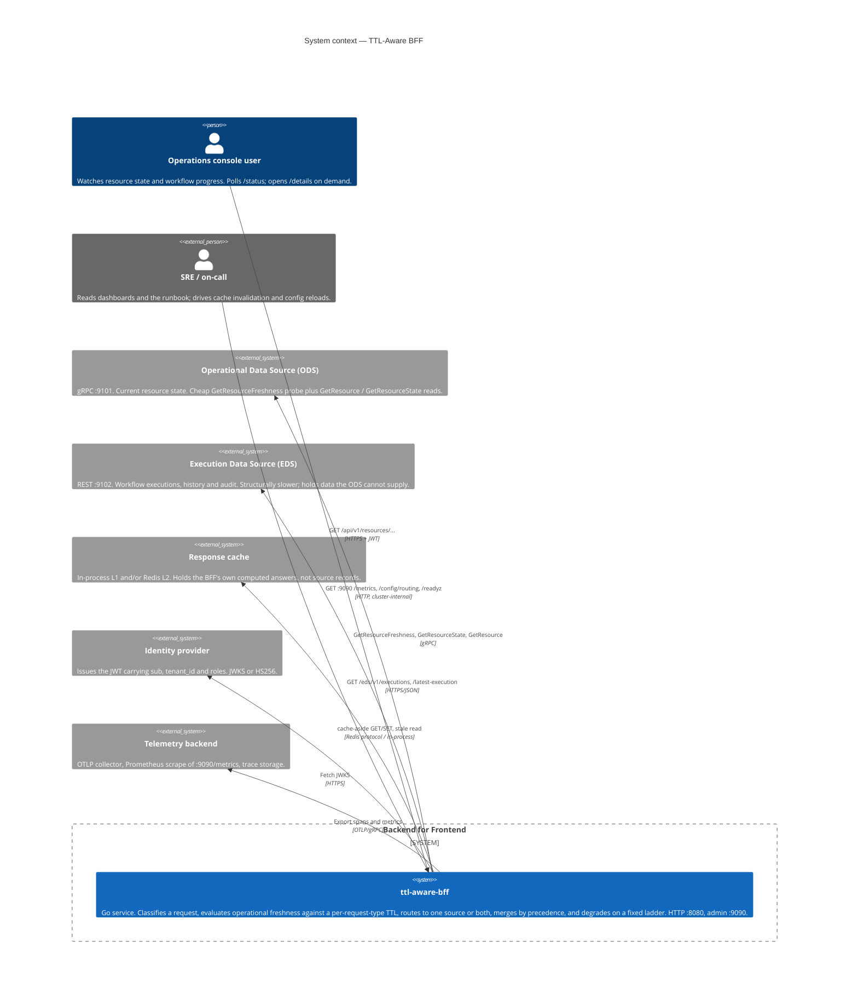
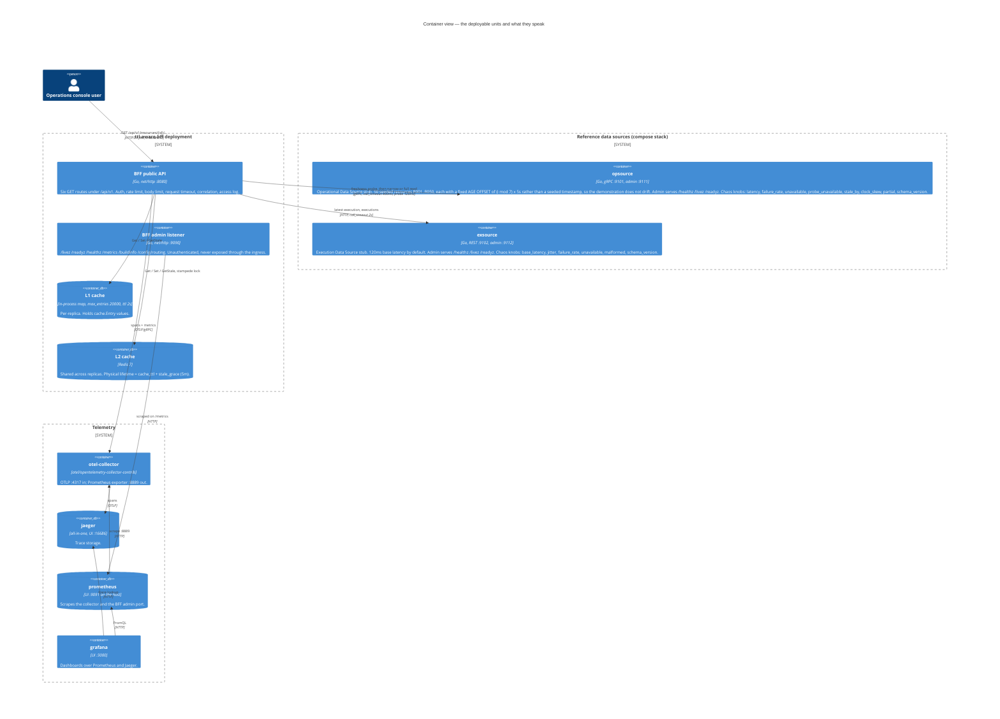
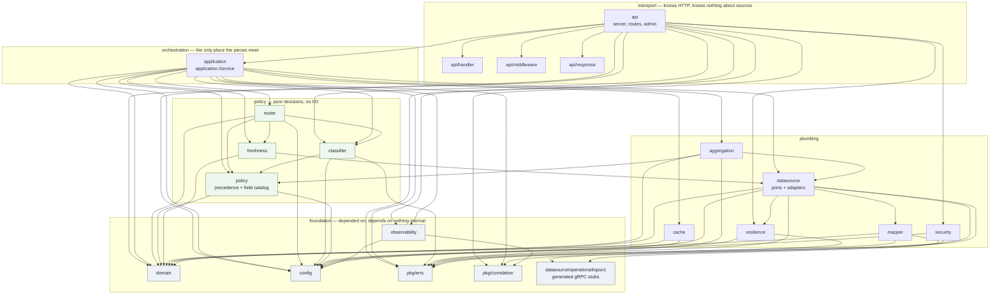
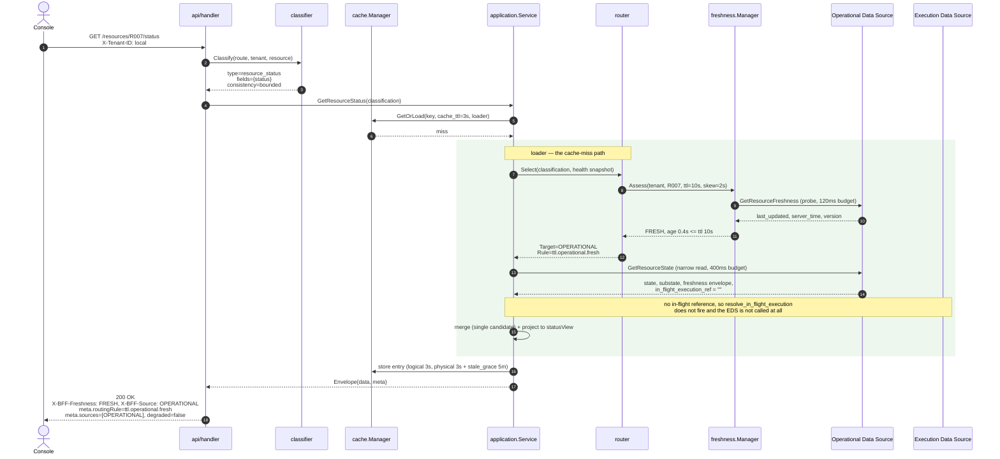
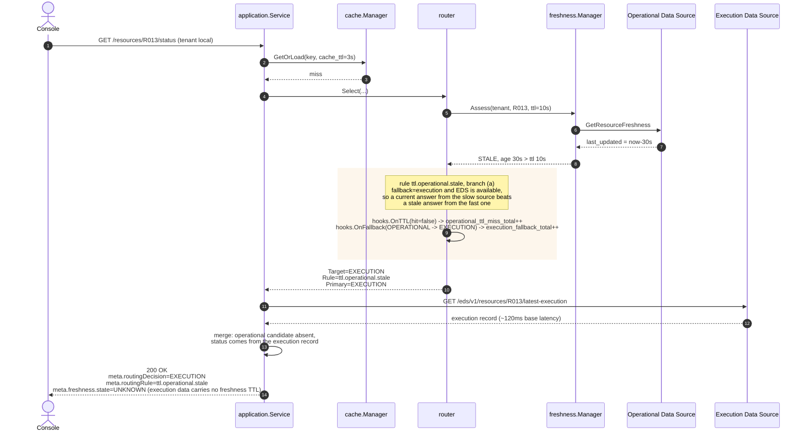
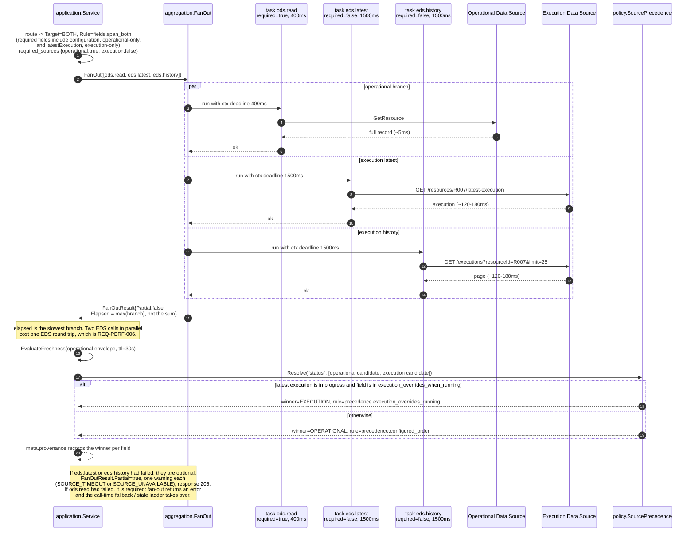
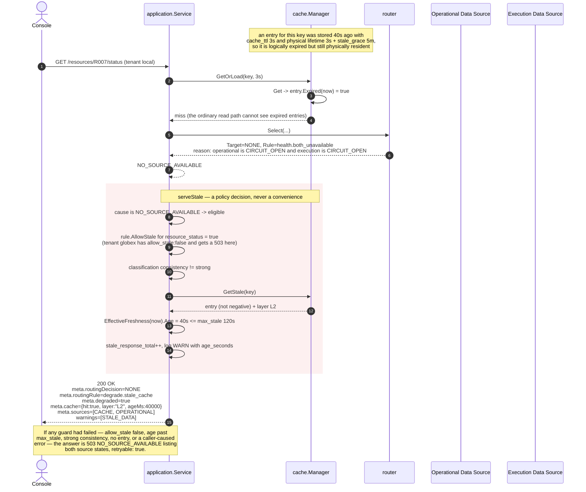
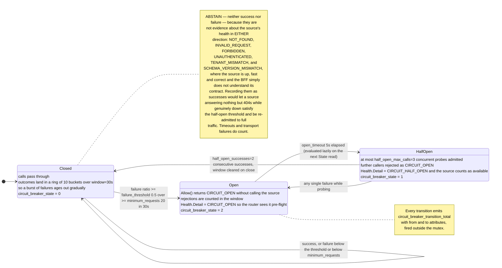
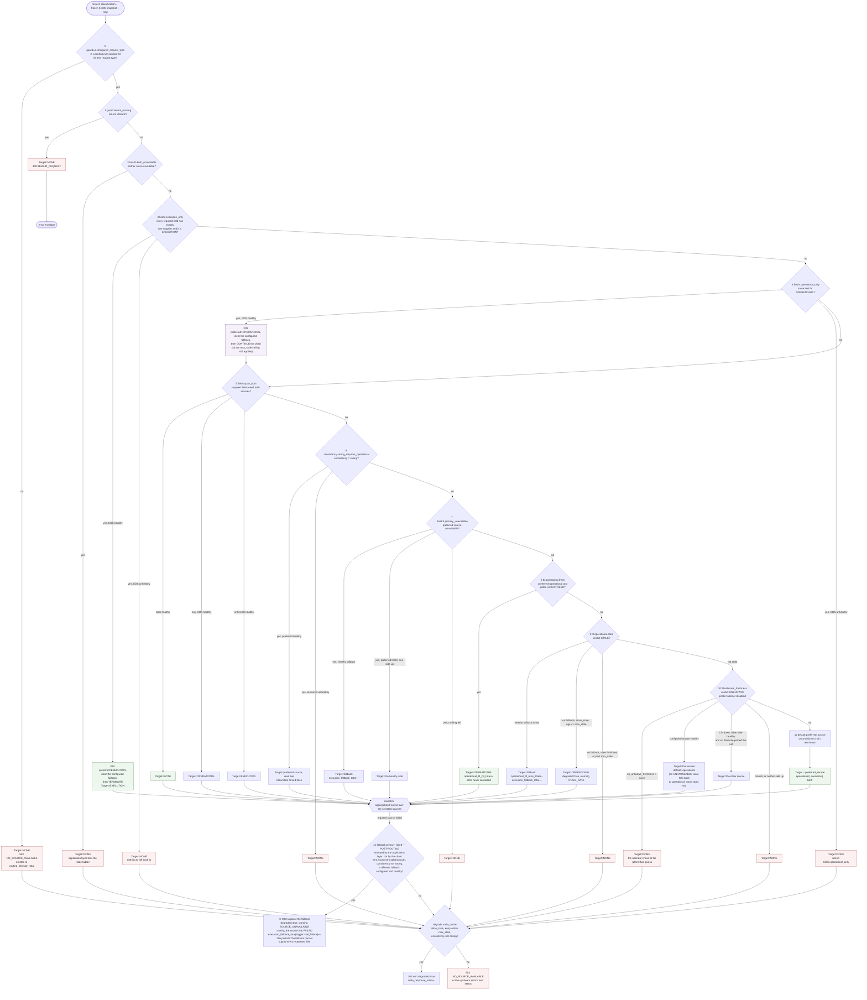
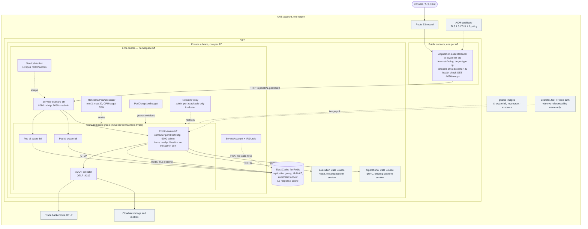

# TTL-Aware BFF — Architecture

This document is the visual companion to the specifications. It shows the same
system twelve ways: five levels of structure, five request paths, one state
machine and one failure-mode map. The prose exists to say what each picture is
claiming and why the design is that shape; every claim in it is checkable
against `internal/**`, `configs/bff.yaml` and `docs/DESIGN-CONTRACT.md`.

Each diagram is also a standalone file under [`diagrams/`](diagrams/) so it can be
rendered on its own.

**Related documents.** [`DESIGN-CONTRACT.md`](DESIGN-CONTRACT.md) freezes names,
ports, keys and rule ids. [`../spec/requirements.md`](../spec/requirements.md) is
the requirement register. [`../spec/routing-policy.md`](../spec/routing-policy.md)
is the definitive rule-by-rule policy text. [`runbook.md`](runbook.md) is what you
read at 3am.

---

## 0. The problem, and the shape of the answer

A console needs one API over two backends with incompatible performance
profiles. The **Operational Data Source** (ODS, gRPC) holds current resource
state and answers in milliseconds. The **Execution Data Source** (EDS, REST)
holds workflow, history and audit records, structurally slower, and holds data
the ODS simply does not have. Naively fanning out to both on every request makes
every response as slow as the slower source; naively reading only the fast source
makes some answers wrong.

The answer is to make *how old the operational copy is* an explicit, configured,
per-request-type input to routing. If the operational record is inside its
freshness TTL, the request is answered from the fast source and the slow source
is never contacted. If it is not, a named rule decides what happens instead. The
decision is always attributable: every response carries the id of the rule that
produced it.

Three ideas carry the whole design:

1. **Two different TTLs, never conflated.** `ttl` is how old the *source's*
   observation may be. `cache_ttl` is how long the BFF may reuse *its own*
   computed answer. Configuration validation refuses a `cache_ttl` larger than
   the `ttl`, because that would let the cache serve data the freshness policy
   already calls stale.
2. **A rule chain, not nested conditionals.** Eleven ordered predicates, first
   match wins, each with a frozen id that shows up in metrics, traces and the
   response envelope.
3. **A degradation ladder with named rungs.** Preferred source → configured
   fallback at routing time → configured fallback at call time → partial response
   → stale cache serve → 503. Each rung is a policy decision with its own
   observable signal.

---

## 1. Context (C4 level 1)



**What it is showing.** The BFF owns no data. It owns a *decision* — which source
answers, and whether the answer it already has is good enough. That is the entire
value it adds, and it is why the response envelope is as elaborate as it is: a
service whose product is a decision has to publish the decision.

**Why this shape.** Two boundaries matter here. The first is that the console
never talks to the ODS or the EDS directly; if it did, every client would have to
reimplement freshness policy, and the two clients would eventually disagree. The
second is that the SRE surface (`:9090`) is a different listener from the product
surface (`:8080`), unauthenticated and never routed through the ingress, so
`/metrics` and `/config/routing` cannot be reached from the internet and cannot be
starved by API rate limiting.

---

## 2. Containers (C4 level 2)



**What it is showing.** Ports are contract, not convention: they are fixed in
`docs/DESIGN-CONTRACT.md` §1 and every manifest, compose service and test harness
reads them from there. `opsource` and `exsource` are reference implementations of
the two sources, complete with the chaos controls that let the failure tests
drive real degradation instead of mocking it.

**Why two cache tiers.** L1 is a per-replica map with a 2s TTL; L2 is Redis,
shared. The split is a latency/coherence trade: L1 removes the network hop for
the hottest keys, and its very short TTL bounds how far two replicas can disagree.
A promotion from L2 into L1 carries the *remaining* lifetime of the L2 entry, not
a fresh L1 TTL, so promotion can never extend an entry's life.

**Why the timeouts are asymmetric.** `sources.operational.call_timeout` is 400ms
and `sources.execution.call_timeout` is 2s. The ODS is supposed to be fast, so a
slow answer from it is a signal rather than something to wait out. The EDS
genuinely is slower; what stops that from mattering is the bulkhead —
`max_concurrent: 64` for the EDS versus `256` for the ODS — which caps how much
of the BFF a slow execution source can occupy.

---

## 3. Components: the package graph



**What it is showing.** Every arrow is a real import edge, read from the source.
Four properties are load-bearing and each is visible as an *absence* in the graph:

| Property | Visible as |
|---|---|
| `domain` is the canonical model and has no internal dependencies | no arrow leaves `domain` |
| No package below the transport layer knows about HTTP | nothing points at `api`, `api/handler`, `api/response`, `api/middleware` |
| Routing is a pure function | `router` imports only `classifier`, `config`, `domain`, `freshness`, `policy` — no adapters, no cache, no observability |
| The pieces meet in exactly one place | `application` is the only package importing `router` **and** `cache` **and** `datasource` **and** `aggregation` |

Two consequences follow. The router's tests are truth tables over a value struct,
with no fakes, no HTTP and no clock. And the request lifecycle is testable without
a server, because `application` speaks only ports and canonical types.

`observability` is imported by `application` and `api` but by none of the pure
policy packages. Those packages report events through small `Hooks` structs
(`router.Hooks`, `cache.Hooks`, `aggregation.Hooks`) that the composition root
wires to metric instruments. This keeps `router` free of a telemetry dependency
without giving up per-rule metrics.

---

## 4. Request path: a TTL hit



**What it is showing.** The path the whole system exists to optimise: one cheap
probe plus one narrow gRPC read, and the expensive source is never touched.

**Three details worth naming.**

The probe is a separate RPC with its own budget (`freshness_probe_timeout: 120ms`
against a `call_timeout: 400ms`). Configuration validation enforces
probe < call. If the probe were not materially cheaper than the read it avoids,
the design would be worthless — a miss would pay probe + read.

The probe result is memoised for `probe_cache_ttl: 1s`, and what is memoised is
the *observation* (`last_updated`, `server_time`, `version`), never the verdict. A
cached verdict stops ageing: an entry judged FRESH at age 9.8s against a 10s TTL
would still claim FRESH five seconds later. Storing the observation and
recomputing keeps the memo honest.

Recomputing alone is not quite enough, though, and `cachedProbe.age` is the piece
that closes the gap. `last_updated` is a fact about the source and does not move,
but `server_time` is the instant the source *answered* — so replaying the pair
verbatim would recompute the age the record had when the probe was taken, not the
age it has now. The manager therefore advances the memoised `SourceTime` by the
time the entry has spent in the memo. That keeps the subtraction inside the
source's own clock domain, which is what makes it skew-proof, while still
accounting for the wall time that has passed, so **a memoised probe can never
make a record look fresher than it is.**

The `/status` endpoint uses `GetResourceState`, a narrow RPC, rather than the full
`GetResource`. The tightest endpoint should not pay for configuration, metrics and
topology it is about to discard. Everything else still goes through the same merge
path, which is why `/status` and `/details` cannot disagree about a resource's
status.

---

## 5. Request path: a TTL miss



**What it is showing.** A TTL miss is not an error and not a degradation by
itself; it is a *route change*, and it is the point at which the request starts
paying the EDS latency profile.

**Why the branch order is fallback-first.** Rule 9 tries the configured fallback
before it considers serving stale operational data. A current answer from the slow
source beats a stale answer from the fast one — but only when the slow source can
actually supply the fields. `resource_configuration` has `fallback: none` precisely
because the EDS structurally cannot supply configuration; a fallback there would be
a lie rather than a degradation. When no fallback applies, rule 9 falls to serving
stale operational data if `allow_stale` permits and the age is within `max_stale`,
and refuses outright otherwise.

**Why the reported freshness is UNKNOWN.** Only the operational source publishes a
freshness envelope. An execution-sourced answer reports `UNKNOWN` rather than
borrowing the operational verdict, because the EDS makes no freshness guarantee and
claiming one would be a fabrication.

---

## 6. Request path: the BOTH fan-out



**What it is showing.** Three concurrent calls, each with its own derived context
and its own budget from
`routing.request_types.resource_details.per_source_timeout` (`operational: 400ms`,
`execution: 1500ms`).

**Why the fan-out does not cancel on first error.** It deliberately does not use
errgroup's cancel-on-first-error behaviour. If the execution branch fails at 50ms,
cancelling the still-running operational call would throw away data the response
could have used and would turn a partial answer into no answer at all. Every task
runs to completion or exhausts its own budget, and one source's timeout cannot
cancel another's call.

**Required versus optional is a configuration decision.**
`required_sources: {operational: true, execution: false}` is why a slow or failing
EDS yields a `206` with `partial: true` and a warning naming the source, rather
than a `500`. The heavy endpoint degrades to a fast operational-only answer instead
of inheriting the EDS latency profile as a hard dependency. `eds.history` is marked
optional in code regardless of configuration: execution history is never worth
failing a details view for.

**Merging is not last-writer-wins.** Every field both sources can supply goes
through `SourcePrecedencePolicy`, and the winner is recorded in
`meta.provenance`. The resolution order deliberately excludes "whichever timestamp
is newer": the EDS can legitimately hold a newer timestamp for a status it is only
*predicting* from a workflow, while the ODS holds the older but observed truth.
Choosing by recency would silently invert the intended precedence. The only way
execution data outranks operational data is the explicit
`execution_overrides_when_running: [status, subState]` list, and only while a
workflow is actually in progress.

**The `resolve_in_flight_execution` bridge.** `/status` is an operational-only
read, so the precedence override above could never fire for it — the execution
candidate would not exist. Without something extra, `/status` and `/details` would
report different statuses for the same resource mid-workflow, and the UI would see
the answer change depending on which screen it was on. So when the operational
record itself declares an `in_flight_execution_ref`,
`routing.defaults.resolve_in_flight_execution: true` makes the BFF fetch that one
execution with its own `in_flight_lookup_timeout: 300ms`. The common case pays
nothing, because the extra call is made only when the record says a workflow is
running. It is best-effort: a failure is logged at debug and the operational answer
stands unchanged.

**The marker alone never confers authority.** `Merger.Merge` sets
`ExecutionInProgress` only when there is an execution *candidate* whose status is
actually `InProgress`; an `in_flight_execution_ref` with no such candidate is
carried into `meta` and into `data.inFlightExecutionId` for information, and the
id is recorded on the precedence context, but the override does not fire. A
marker left behind by a workflow that has since finished would otherwise let a
completed execution's *predicted* status outrank the operational source's
*observed* one — and `/details` would then disagree with `/status`, which is
exactly what this bridge exists to prevent.

---

## 7. Request path: the call-time fallback

```mermaid
sequenceDiagram
    autonumber
    actor UI as Console
    participant SVC as application.Service
    participant R as router
    participant BRK as resilience.Breaker (operational)
    participant ODS as Operational Data Source
    participant EDS as Execution Data Source

    UI->>SVC: GET /resources/R007 (resource_read, fallback: execution)
    SVC->>R: Select(...) with health snapshot
    BRK-->>R: state=closed -> Health{Available:true, Detail:"HEALTHY"}
    R-->>SVC: Target=OPERATIONAL, Rule=ttl.operational.fresh<br/>Fallback=EXECUTION carried on the decision

    SVC->>ODS: GetResource (400ms budget, bounded retry)
    ODS--x SVC: UNAVAILABLE (x3 attempts, retry budget exhausted)
    ODS-->>BRK: failures recorded in the rolling window

    rect rgb(253, 246, 236)
        note over SVC: fallbackDecision refuses when falling back would be wrong:<br/>cause not errs.SourceUnusable (404, 400, 403), consistency=strong,<br/>fallback none or equal to primary, BOTH whose required side failed,<br/>or a fallback that is itself unhealthy.
        SVC->>SVC: cause is SourceUnusable, consistency=bounded,<br/>fallback=EXECUTION and it is healthy -> proceed
        SVC->>SVC: execution_fallback_total{trigger="call_failure"}++<br/>log WARN "preferred source failed; falling back"
    end

    SVC->>EDS: GET /resources/R007/latest-execution
    EDS-->>SVC: execution record
    SVC-->>UI: 200 OK<br/>meta.routingDecision=EXECUTION<br/>meta.routingRule=fallback.primary_failed<br/>meta.degraded=true<br/>warnings=[SOURCE_UNAVAILABLE]

    note over BRK: Once enough failures accumulate<br/>(failure_threshold 0.5 over minimum_requests 20 in a 30s window)<br/>the breaker opens and subsequent requests take the<br/>*pre-flight* path instead: rule health.primary_unavailable,<br/>and no doomed call is issued at all.
```

**What it is showing.** The twelfth rule id, `fallback.primary_failed`, and why it
has to exist even though rule 7 already handles an unhealthy primary.

**Why pre-flight health routing is not enough.** The router's health snapshot comes
from the resilience layer — breaker state and bulkhead saturation — read locally,
with no network call, because the router consults it on every request. That
snapshot can only describe an outage the breaker has already *learned about*. The
first failures of any outage necessarily arrive before the breaker has seen enough
of them to trip: with `minimum_requests: 20` and `failure_threshold: 0.5` over a 30s
window, at least ten failures land before rule 7 can help. Without a call-time
fallback, those requests fail even though a perfectly healthy fallback source was
sitting there. So the configured fallback travels on every decision, whether or not
the rule that fired used it, and the application layer retries against it after a
real failure.

**Where it deliberately refuses.** `fallbackDecision` returns false — no fallback,
propagate the original error — in five cases, each because falling back would be
*wrong* rather than merely unhelpful:

The gate is `errs.SourceUnusable`, not `errs.IsDegradable`, and the distinction is
deliberate. `SourceUnusable` is the wider predicate: it means "the source that
produced this error cannot serve this request, but a different source might".
`UPSTREAM_TIMEOUT`, `UPSTREAM_UNAVAILABLE`, `UPSTREAM_INVALID_RESPONSE` and
`SCHEMA_VERSION_MISMATCH` all qualify. The last two are *terminal* rather than
degradable — retrying cannot help, and no amount of waiting makes an incompatible
contract compatible — but they are still a reason to try the other source, in
exactly the way a timeout is. `NOT_FOUND` and the other client faults do not
qualify: asking a second source about a resource the first authoritatively does
not have would turn a correct answer into a wrong one.

| Condition | Why refusing is correct |
|---|---|
| The cause is not `errs.SourceUnusable` (`404`, `400`, `403`, `INTERNAL`) | A second source cannot fix a client's mistake, and a 404 from the ODS is an answer, not a failure |
| `consistency = strong` | The caller asked for one specific source's live answer and must not silently receive another's |
| `fallback` is `none`, or equals the primary | There is nowhere to go |
| Target was `BOTH` and the fallback is `execution` | The side that failed was the required one; the fallback names the side that is already missing |
| The fallback source is itself unhealthy | Issuing a call that is certain to fail wastes the caller's remaining budget |

When the fallback does run and *also* fails, the **primary's** error is what gets
reported — the fallback's is logged at warn and discarded. That is not merely a
preference for the more informative message: the fallback's error describes a
source the caller never asked about, and a `NOT_FOUND` from the execution source
means only that the resource has no execution history. Returning it would turn a
transient operational outage into a `404`, and — because `resourceView` negatively
caches a `NOT_FOUND` — would then cache that `404` for `negative_ttl` against a
resource that plainly exists. Reporting the primary's error is what keeps a
fallback-path `NOT_FOUND` out of the negative cache entirely.

**A fallback answer that cannot cover the request is a `206`.**
`targetMissesRequiredFields` checks each required field against the catalogue: a
field is unsatisfiable only when **none** of its suppliers is in the chosen
target. So `/resources/{id}` (`resource_read`) answered by the EDS is a `206`
with a `PARTIAL_DATA` warning, because the execution source holds no
`configuration`, `owner`, `metrics` or `topology`; `/status` answered by the EDS
stays `200`, because `status` lists the execution source as a supplier. Testing
against each field's *most authoritative* supplier instead would flag every
fallback answer as partial, including ones the fallback can legitimately serve.

---

## 8. Request path: stale-cache degradation



**What it is showing.** The last rung of the ladder, and the mechanism that makes
it possible: a cache entry has **two** lifetimes.

| Lifetime | Value | Enforced by | Visible to |
|---|---|---|---|
| Logical (`CacheTTL`) | the request type's `cache_ttl` (3s for `resource_status`) | `Manager.Get` via `entry.Expired(now)` | the ordinary read path; reported in the envelope |
| Physical | `cache_ttl + cache.stale_grace` (3s + 5m) | the backend's own TTL, set in `Manager.store` | only `Manager.GetStale` |

`GetStale` is a separate method rather than a flag on `Get`, so no ordinary read
path can reach expired data by accident. Reaching it requires four things at once:
an `errs.SourceUnusable` cause (or `NO_SOURCE_AVAILABLE`), `allow_stale` on the
request type, a consistency level below `strong`, and an entry whose effective age
is within `max_stale`.

The cause predicate is deliberately the **same one the call-time fallback uses**.
The stale rung sits below the fallback rung on the ladder, so anything that
justified trying another source must also justify serving an old answer once that
source is gone too; using a narrower predicate here would leave a hole where a
request could fall past a fallback it was allowed to take and then be refused a
cached answer it was also allowed to take.

A stale-served response also **carries the cached entry's own `provenance`,
`warnings` and `partial` flag forward**. A stale serve is exactly when a caller
most needs to know where each field came from, and dropping the flag would
silently turn a partial answer back into an apparently complete one.

**This is where tenant configuration becomes observable behaviour.** Tenant `local`
inherits `resource_status.allow_stale: true, max_stale: 120s` and gets the degraded
`200` above. Tenant `globex` overrides `allow_stale: false` and gets a `503` for
the identical request against the identical cache state — which is the point:
"prefer correctness over latency" is four lines of YAML, not a code path.

**Degraded *and partial* answers are cached briefly.** `Manager.store` clamps the
TTL of an entry marked `Degraded` **or** `Partial` to `negative_ttl` (3s), so the
degradation cannot outlive the incident that produced it. Partial matters as much
as degraded: an answer missing its execution half would otherwise be replayed to
every caller for the full cache TTL, long after the execution source came back.

**A cache hit can report STALE.** Cached entries carry their own freshness,
provenance and warnings. On a hit, `EffectiveFreshness(now)` re-reports the stored
freshness with the accumulated cache age added, so an entry that aged past its
freshness TTL while sitting in the cache is reported as `STALE` and `degraded`,
with a warning, even though the cache hit itself was perfectly valid. The cache is
never permitted to assert freshness on its own authority.

**An `UNKNOWN` entry stays `UNKNOWN`.** `EffectiveFreshness` re-derives `FRESH` or
`STALE` from the accumulated age only when the stored verdict was one of those two.
Ageing an `UNKNOWN` into `STALE` would look conservative but is actually a loss of
information: the router treats the two differently on purpose (rule 9 versus rule
10), and a cache hit must not manufacture a verdict the original read never
produced.

---

## 9. Circuit breaker states



**What it is showing.** One breaker per source, with the real numbers from
`configs/bff.yaml` (identical for both sources today).

**Four design choices, each fixing a specific failure mode.**

| Choice | Failure mode it prevents |
|---|---|
| Rolling window as a ring of 10 buckets, not a counter pair | A breaker that clears its whole window on a tick boundary flaps: it forgets an outage wholesale and re-admits full traffic |
| `minimum_requests: 20` gate on the ratio | Without it, the first failed call after a quiet period trips at a 100% failure ratio |
| Half-open admits at most 3 probes and needs 2 consecutive successes | One lucky call must not re-admit full traffic to a source that is still unwell |
| Client-caused errors **abstain** — `Breaker.Do` returns without calling `Record` at all | A burst of 404s from a UI polling a deleted resource must not open the circuit on a healthy source. Abstaining rather than recording a success is the symmetric half: a source answering nothing but 404s while it is genuinely down would otherwise accumulate "successes", satisfy the half-open threshold and be re-admitted to full traffic |
| `bucketIndex` clamps at zero | A backwards wall-clock step, under an injected clock that has dropped its monotonic reading, would otherwise produce a negative ring index and panic inside a held mutex |
| A schema-version mismatch abstains too | The source is up, fast and answering correctly; the BFF just does not understand the contract it is speaking. Counting it as a health failure would trip the breaker on a healthy source, quietly reroute every request to the slower one, and replace a loud version-incompatibility alert with a vague availability one. It surfaces through `schema_version_mismatch_total`, through a `502` where no fallback exists, and through the call-time fallback where one does |

**How the breaker reaches routing.** `Executor.Healthy()` is false when the breaker
is open or the bulkhead is saturated, and `HealthDetail()` renders the reason as
`CIRCUIT_OPEN`, `CIRCUIT_HALF_OPEN`, `SATURATED`, `HEALTHY` or `UNCONFIGURED`.
That string is what appears in the routing decision's `Reason` and in the `sources`
array of an error document, so an operator reads the cause rather than inferring it.
Note that a half-open source still counts as *available* for routing: the router
will select it, and the breaker's own probe budget is what limits the exposure.

**The lazy transition.** `Open → HalfOpen` is evaluated inside `State()`, not by a
timer. There is no background goroutine per breaker, and a breaker on a source
nobody is calling costs nothing.

---

## 10. The full routing rule chain



Three nodes in that picture are not ordinary rules.

**Rules 3 and 4 both pin.** Pinning fixes the source set *and clears the
configured fallback*, because a fallback source that cannot supply the requested
fields is not a fallback, it is a wrong answer — and `finish()` would otherwise
re-attach the configured one. A pin also binds rule 10, which may not cross it to
reach the other source. Where they differ is what happens next: rule 3
terminates, while **rule 4 re-enters the chain**, so every operational-only
request type is still decided by rules 8, 9 or 10 and is still subject to the
`max_stale` ceiling.

**`guard.unconfigured_request_type` is a pre-chain exit**, not a rule. It fires
when the request type has no routing rule at all — a deployment error rather than
a routing outcome — and it is reported to `routing_decision_total` like every
other decision, because a configuration that has lost a request type should be
visible in the metric an operator reads first rather than only in a log line.

**`fallback.primary_failed` is not in the chain at all**: it is stamped after
dispatch, by the application layer, once a source call has actually failed.

### 10.1 The rules, in order

| # | Rule id | Fires when | Produces |
|---|---|---|---|
| 1 | `guard.tenant_missing` | No resolved tenant on the classification | `NONE` → `400` |
| 2 | `health.both_unavailable` | Neither source available | `NONE` → the stale ladder |
| — | `guard.unconfigured_request_type` | **Before the chain runs**: the request type has no routing rule at all | `NONE` → `503`. Emitted to `routing_decision_total`; a non-zero rate is a deployment defect, not a routing outcome |
| 3 | `fields.execution_only` | Every required field has exactly one supplier, and it is the EDS | **Pins** the source to the EDS and clears the configured fallback, then terminates: `EXECUTION`, or `NONE` if the EDS is down |
| 4 | `fields.operational_only` | Same test for the ODS | Pins the same way, but *continues* the chain instead of terminating — so rules 8/9/10 still decide and the `max_stale` ceiling still applies. Emits its own id only when the ODS is down, and then as `NONE` |
| 5 | `fields.span_both` | The required fields' primary suppliers include both sources | `BOTH`, or the healthy side alone |
| 6 | `consistency.strong_requires_operational` | `consistency = strong` | Live read of the preferred source, `AllowStale` forced false |
| 7 | `health.primary_unavailable` | The preferred source is unavailable pre-flight. `preferred_source: both` is matched on the configured *string*, since "both" is not a `SourceKind` and parses to none | The configured fallback, the healthy half of a `both`, or `NONE`. `degraded: true` with a `SOURCE_UNAVAILABLE` warning naming the source that failed |
| 8 | `ttl.operational.fresh` | Preferred is operational and the probe says `FRESH` | `OPERATIONAL`; the EDS is not contacted |
| 9 | `ttl.operational.stale` | Preferred is operational and the probe says `STALE` | Fallback first, then stale-serve, then `NONE` |
| 10 | `ttl.unknown_freshness` | Preferred is operational and the verdict is `UNKNOWN` | `routing.defaults.on_unknown_freshness`. `none` is **honoured** and yields `NONE`; only an *unparseable* value falls back to `operational`. Crossing to the other side is allowed only when no field rule pinned the set |
| 11 | `default.preferred_source` | Always — the terminator | The configured `preferred_source` |
| — | `fallback.primary_failed` | **Not in the chain.** Stamped after dispatch when the preferred source actually failed, gated on `errs.SourceUnusable` | The configured fallback, `degraded: true`, warning `SOURCE_UNAVAILABLE` |
| — | `degrade.stale_cache` | **Not in the chain.** Stamped by `Service.serveStale` when every source refused and an expired-but-resident entry passes the four gates | `NONE`, `degraded: true`, warning `STALE_DATA` |

### 10.2 Which rule each endpoint actually hits

The chain is data-driven, so the rule a given endpoint fires is a consequence of
the field catalogue in `precedence.fields`, not of endpoint-specific code. With the
shipped configuration:

| Endpoint | Required fields | Exclusive to one source? | Rule that fires (healthy sources) |
|---|---|---|---|
| `/status` | `status` | No — `status` lists both sources | 8, 9 or 10 depending on the probe verdict |
| `/configuration` | `configuration` | Yes, operational | **4 pins**, then 8, 9 or 10 decides |
| `/resources/{id}` | `status`, `subState`, `configuration`, `owner`, `metrics`, `topology`, `labels`, `customerId` | No | 8, 9 or 10 |
| `/details` | the above plus `latestExecution`, `executionHistory` | No — spans both | **5** |
| `/executions` | `executionHistory` | Yes, execution | **3** |
| `/executions/{id}` | `executionStatus`, `workflowSteps` | Yes, execution | **3** |

`/status` asks for `status` alone. `subState` was deliberately dropped from the
required set: it is `omitempty` decoration that no caller can depend on, and
listing it as required would make every answer from a source that does not model
it look incomplete — which, now that an under-covered fallback answer is a `206`,
would turn a perfectly good execution-sourced status into a partial response.

Two consequences are worth stating plainly because they are easy to get wrong when
reading the policy text alone.

`/configuration` normally emits a TTL rule id — `ttl.operational.fresh` or
`ttl.operational.stale` — not `fields.operational_only`. Rule 4 *pins* rather than
terminates: it sets the preferred source to the ODS, clears the configured
fallback, and returns `handled=false` so evaluation continues.

The reason is a safety property, not an optimisation. Terminating at rule 4 would
skip the TTL rules, and with them the `max_stale` ceiling — so `resource_configuration`,
whose fields no other source holds, would happily serve a record of any age. The
ceiling has to hold precisely for the request type that has nowhere else to go.
Pinning also clears the fallback, because a fallback source that cannot supply the
requested fields is not a fallback, it is a wrong answer; rules 8/9/10 therefore
see `preferred = operational, fallback = none` and will serve the record, serve it
as stale-but-permitted, or refuse.

Rule 4 emits its own id in exactly one case: the ODS is unavailable, in which case
it terminates with `Target = NONE` and the ladder takes over.

Rule 3, `fields.execution_only`, pins in exactly the same way and for the same
reason — it clears the configured fallback so `finish()` cannot re-attach a source
that lacks the requested fields — but it *terminates* on both branches. TTL
semantics belong to the operational source, so once the answer can only come from
the EDS there is nothing further for the chain to evaluate.

Rule 11 is unreachable for all six shipped request types. Every one of them is
caught by rules 3, 5, 8, 9 or 10 (rule 4 pins but never terminates on the healthy
path). Rule 11 exists to make the chain *total*: a `Decision` with an empty `Rule`
is a defect, and the terminator is what makes that impossible even if a future
request type arrives with no freshness semantics.

### 10.3 Why a chain rather than nested conditionals

The decision space is roughly `6 request types × 3 freshness verdicts × 3 health
states² × 3 consistency levels × 2 allow_stale × 3 fallback settings`. As nested
conditionals across six handlers, that is hundreds of reachable paths with nothing
preventing two handlers from disagreeing. As a chain it is eleven predicates
evaluated once each, and:

- **every decision is attributable** — the rule id is a metric attribute, a span
  attribute and a response field, so "why did we call the slow source a thousand
  times more this hour?" is one `group by routing_rule` query;
- **the whole policy is a truth table** — the rules are pure functions of a value
  struct, so the tests need no HTTP, no gRPC and no clock;
- **tenant variation is an overlay, not a branch** — `tenants.acme` gets
  `resource_status.ttl: 5s` from four lines of YAML;
- **adding a rule is an insertion** — a new `cost.budget_exceeded` rule is one
  position in the chain plus one row in the truth table.

What is deliberately *not* configurable is the chain's **order**. Configuration
varies the parameters of the rules; the code owns their sequence. Making order
configurable would let an operator build an incoherent policy — freshness evaluated
before the tenant guard — and would make the truth tables unverifiable.

---

## 11. Deployment on AWS



**What it is showing.** The Terraform stack (`deploy/terraform`) provisions the VPC,
the EKS cluster, the ElastiCache replication group, the ALB, the IAM/IRSA roles and
the observability wiring. The Kubernetes manifests (`deploy/k8s`, and the equivalent
Helm chart in `deploy/helm/ttl-aware-bff`) provision the workload.

**Four numbers that have to agree, and where they come from.**

| Constraint | Values | Where |
|---|---|---|
| `preStop` sleep + `server.shutdown_grace` < `terminationGracePeriodSeconds` | 10s + 25s < 45s | `configs/bff.yaml`, `deploy/k8s/deployment.yaml` |
| `server.request_timeout` > the slowest per-source budget, and comfortably < the ALB idle timeout | 8s > 2s | `configs/bff.yaml` |
| `freshness_probe_timeout` < `call_timeout` | 120ms < 400ms | enforced by config validation |
| HPA `minReplicas` = Deployment `replicas`, and the PDB stays satisfiable | 3 = 3 | `deploy/k8s/hpa.yaml`, `deployment.yaml`, `pdb.yaml` |

**Why the ALB health-checks `:9090/readyz` and not `:8080`.** Readiness answers
"should traffic be sent here?", and it deliberately does **not** fail on a source
outage: with both sources down the BFF can still serve stale cached data, and
removing every pod from the load balancer would turn a degraded service into no
service. It reports the source states in its body for humans, and returns `200`
with `status: degraded`. Liveness is stricter about its independence: it depends on
no external system at all, because a source outage is not a reason for the kubelet
to restart the process, and a liveness probe that checks dependencies converts a
dependency blip into a cluster-wide restart storm.

**Why the admin port is not on the ingress.** `/metrics`, `/buildinfo` and
`/config/routing` are unauthenticated. The `NetworkPolicy` is what keeps them
cluster-internal; the ingress only ever routes `:8080`.

---

## 12. Failure modes

Every row below is a behaviour with an implementation, a signal and a defined HTTP
result. "Signal" is what you would query or grep to confirm the mechanism fired.

| # | Failure | Mechanism that handles it | Observable signal | HTTP result |
|---|---|---|---|---|
| 1 | Operational record inside its TTL | Rule 8 `ttl.operational.fresh`; EDS not contacted | `operational_ttl_hit_total++`; `routing_decision_total{routing_rule="ttl.operational.fresh"}`; `meta.freshness.state=FRESH` | `200` |
| 2 | Operational record past its TTL, fallback configured and healthy | Rule 9 branch (a) → EDS | `operational_ttl_miss_total++`, `execution_fallback_total++`; `meta.routingRule="ttl.operational.stale"` | `200` |
| 3 | Past TTL, no usable fallback, `allow_stale`, within `max_stale` | Rule 9 branch (b) → stale operational read | `meta.degraded=true`, warning `STALE_DATA`, `X-BFF-Degraded: true` | `200` |
| 4 | Past TTL, `allow_stale: false` or age past `max_stale` | Rule 9 branch (c) → ladder | `routing_decision_total{routing_decision="NONE"}` | `503 NO_SOURCE_AVAILABLE` |
| 5 | Freshness probe times out or errors | Verdict `UNKNOWN` → rule 10 → `on_unknown_freshness`. `none` is honoured and yields `NONE`; only an unparseable value falls back to `operational`. A pin from rule 3/4 forbids crossing to the other source | `router.Hooks.OnProbeErr`; `meta.freshness.state=UNKNOWN` | `200`, or `503` under `none` |
| 6 | ODS breaker already open at routing time | Rule 7 `health.primary_unavailable` → configured fallback | `execution_fallback_total++`; `circuit_breaker_state{source="operational"}=2`; warning `SOURCE_UNAVAILABLE` naming **OPERATIONAL**, the source that failed | `200` degraded, or `206` when the fallback cannot supply every requested field (`/resources/{id}`) |
| 7 | ODS fails on the call, breaker still closed | `fallback.primary_failed` in the application layer | `execution_fallback_total{trigger="call_failure"}++`; WARN "preferred source failed; falling back" | `200` degraded, or `206` when the fallback cannot supply every requested field |
| 8 | ODS unavailable and `fallback: none` (`/configuration`) | Ladder: fresh cache → stale cache → refuse | `stale_response_total++` if stale-served | `200` degraded, else `503` |
| 9 | EDS unavailable, request type is execution-only | Rule 3 with an unhealthy EDS → `NONE`; no operational substitution | `datasource_error_total{source="EXECUTION"}` | `503 UPSTREAM_UNAVAILABLE` |
| 10 | EDS unavailable, `/details` (execution optional) | Fan-out marks the task optional; response is partial | `partial_response_total++`; warning `SOURCE_UNAVAILABLE`; `meta.partial=true` | `206` |
| 11 | EDS exceeds its per-source timeout on `/details` | Task's own derived context expires; other tasks continue | Warning `SOURCE_TIMEOUT`; `TaskResult.TimedOut` | `206` |
| 12 | Required source times out | `UPSTREAM_TIMEOUT` → call-time fallback → ladder. If the fallback also fails, the **primary's** error is reported and a fallback-path `NOT_FOUND` is never negatively cached | `datasource_error_total{error_code="UPSTREAM_TIMEOUT"}` | `504`, or `200`/`206` if the ladder catches it |
| 13 | Both sources unavailable, usable cache entry, `allow_stale` | `degrade.stale_cache` via `Manager.GetStale` within `stale_grace` | `stale_response_total++`; `meta.routingRule="degrade.stale_cache"`; `meta.cache.hit=true` | `200` degraded |
| 14 | Both sources unavailable, no usable entry or stale forbidden | Ladder exhausted | `routing_decision_total{routing_rule="health.both_unavailable"}` | `503 NO_SOURCE_AVAILABLE`, `retryable: true` |
| 15 | Cached answer aged past its freshness TTL | `EffectiveFreshness(now)` re-evaluates on every hit | `meta.freshness.state=STALE` with `meta.cache.hit=true`; warning `STALE_DATA` | `200` degraded |
| 16 | N concurrent identical misses | `singleflight` per key, plus an optional Redis lock across processes | One upstream read; `Result.Stampede=true` for the waiters | `200` for all N |
| 17 | Cache backend itself fails | `cache.fail_open: true` — an error is reported as a miss | `cache_error_total++` | unaffected |
| 18 | Resource missing from every consulted source | The guard tests the **fetched inputs**, not the merged output — `Merge` stamps the tenant and resource id first, so a guard on the merged record could never fire and "every source answered with nothing" would be served as a `200` with an empty body. 404 propagates; negatively cached for `negative_ttl: 3s` | `cache` holds a negative entry | `404 NOT_FOUND` |
| 19 | Source returns a malformed record | Adapters and the mapper reject it rather than passing it through | `datasource_error_total{error_code="UPSTREAM_INVALID_RESPONSE"}` | `502 UPSTREAM_INVALID_RESPONSE` |
| 19a | Source declares a schema version the BFF does not accept | **The breaker is untouched** — the source is healthy, only its contract is unintelligible. `errs.SourceUnusable` is true, so the call-time fallback runs where one is configured | `schema_version_mismatch_total`; **no** `circuit_breaker_transition_total` | `200` degraded via the fallback, else `502 SCHEMA_VERSION_MISMATCH` |
| 20 | Source clock disagrees with the BFF's | Age computed in the source's own clock domain (`server_time − last_updated`); fallback arithmetic biased toward "older" | `clock_skew_detected_total++`; `meta.freshness.skewCorrected=true`; warning `CLOCK_SKEW_DETECTED` | unaffected |
| 21 | Both sources supply a field with different values | `SourcePrecedencePolicy` picks by configured order, never by recency | `precedence_conflict_total++`; warning `CONFLICT_RESOLVED`; `meta.provenance` names the winner | `200` |
| 22 | Workflow running; operational record lags behind it | `execution_overrides_when_running: [status, subState]`, plus `resolve_in_flight_execution` so `/status` sees the same execution `/details` does. The override needs an execution candidate that is *actually* `InProgress`; a stale `in_flight_execution_ref` alone does not confer it | `meta.provenance.status="EXECUTION"`; span `bff.resolve_in_flight` | `200` |
| 23 | In-flight execution lookup itself fails | Best-effort: the operational answer stands, logged at debug | span status "in-flight execution lookup failed; operational answer stands" | `200`, unchanged |
| 24 | A slow source consumes the BFF's concurrency | Bulkhead per source (`operational: 256`, `execution: 64`) | `bulkhead_in_flight`, `bulkhead_rejected_total`; `HealthDetail = SATURATED` | `503`, or degraded via the ladder |
| 25 | A single tenant floods the API | Rate limit, per tenant (`rps: 200`, `burst: 400`; `acme` overrides to 500/1000) | `rate_limited_total++` | `429 RATE_LIMITED` |
| 26 | Request has no resolved tenant | Rule 1 `guard.tenant_missing` — fail closed, no default tenant | `routing_decision_total{routing_rule="guard.tenant_missing"}` | `400 INVALID_REQUEST` |
| 27 | Caller asserts a tenant its token does not carry | `ResolveTenant` refuses rather than resolving in either direction | `TENANT_MISMATCH` in the error document | `403` |
| 28 | A configuration reload is invalid | Validation rejects it; the previous configuration stays in force | `reload_failures` on `GET :9090/config/routing` | unaffected |
| 29 | A request type has no routing rule at all | Pre-chain exit `guard.unconfigured_request_type`, reported to `routing_decision_total` rather than only logged | `routing_decision_total{routing_rule="guard.unconfigured_request_type"}` — alert on any non-zero rate | `503 NO_SOURCE_AVAILABLE` |
| 30 | Caller asks for `?consistency=strong` | The cache **read** is bypassed entirely; the loader runs and the result is still written back via `Manager.Store` for callers at weaker levels | `meta.cache.hit` always `false` | `200` |

---

## Appendix A — the response envelope as an audit record

Every success response carries the decision that produced it. This is what makes
the service operable by people who did not write it, and it is why the load tests
can assert *policy* correctness and not just transport correctness.

| Field | Answers |
|---|---|
| `meta.routingDecision` | Which source set answered: `OPERATIONAL`, `EXECUTION`, `BOTH`, `NONE` |
| `meta.routingRule` | *Which named rule decided that*, including `degrade.stale_cache` and `fallback.primary_failed` |
| `meta.sources` | The sources that actually contributed, `CACHE` included |
| `meta.freshness` | `state`, `ageSeconds`, `ttlSeconds`, `observedAt`, `evaluatedAt`, `source`, `skewCorrected`, `version`. `ageSeconds` and `ttlSeconds` come from a custom `MarshalJSON` on `domain.Freshness` — the underlying `time.Duration` fields would otherwise serialise as opaque nanosecond integers — and are **always** emitted, so `state: UNKNOWN` with `ageSeconds: 0` means "no age could be established" |
| `meta.degraded` | The answer is whole but older or from a fallback than intended |
| `meta.partial` | Some requested field group is absent; the response is `206` |
| `meta.cache` | `hit`, `layer` (`L1`/`L2`/`NONE`), `ageMs` |
| `meta.provenance` | Per-field, which source won |
| `meta.warnings` | One entry per thing the caller should know, each with a code and a source |
| `meta.elapsedMs` | Server-side wall time for the request |

Response headers carry the same three facts for anyone reading an access log
without a body parser: `X-BFF-Freshness`, `X-BFF-Source` and, when degraded,
`X-BFF-Degraded: true`.

## Appendix B — spans

These are the spans the service actually emits, read from the `StartSpan` calls
in `internal/**`:

| Span | Emitted by | Notes |
|---|---|---|
| the route pattern, e.g. `GET /api/v1/resources/{resourceId}/status` | `otelhttp` in `api.Server.publicRoutes`, via `WithSpanNameFormatter` | The server span. Named by route *pattern*, never by path, so trace cardinality stays bounded the same way metric attributes do. An unmatched request is named `<METHOD> unmatched` |
| `bff.usecase.resource` | `application.Service.resourceView` | Attributes: `request_type`, `view` (`full`/`status`/`configuration`/`details`) |
| `bff.usecase.execution` | `application.Service.executionView` | Attribute: `request_type` |
| `bff.route` | `application.Service.route` | Attributes: `routing_target`, `routing_rule`, `freshness` |
| `bff.aggregate` | `application.Service.fetch` | Attributes: `routing_target`, `routing_rule`. Wraps the fan-out |
| `bff.resolve_in_flight` | `application.Service.resolveInFlight` | Present **only** when the operational record declared an `in_flight_execution_ref`. Attribute: `execution_id` |

There is deliberately no span per source call, per mapper or per precedence
decision: those are recorded as metrics (`operational_source_latency`,
`execution_source_latency`, `precedence_conflict_total`) rather than as spans, so
a high-rate read path does not pay for span construction it will not be read
from.
