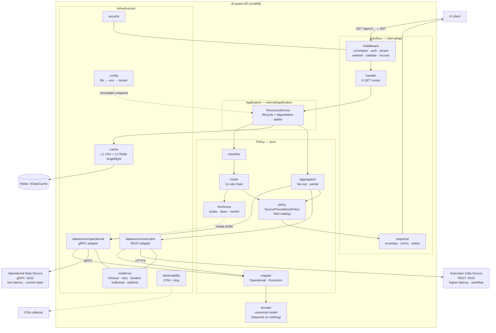
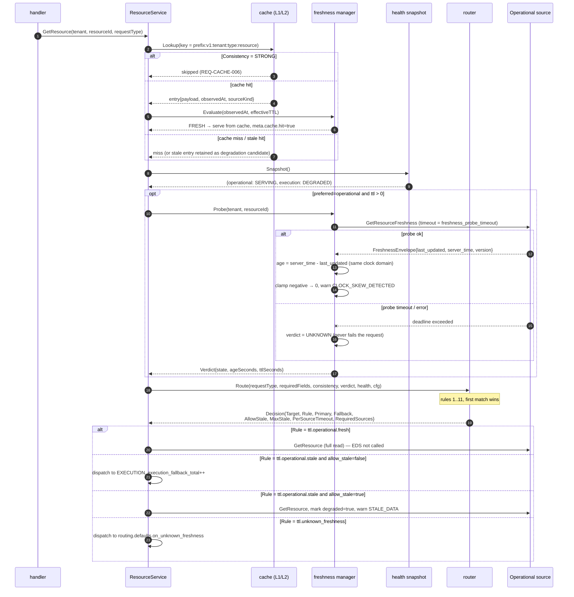
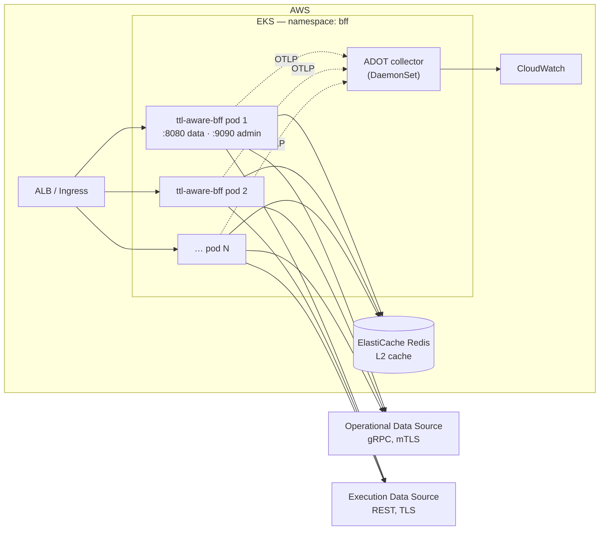

# TTL-Aware BFF — Architecture

Scope: the internal structure of `github.com/udaykishore-resu/ttl-aware-bff`, the
dependency rule that keeps it maintainable, the request lifecycle, the
concurrency model, failure domains and the scaling model.

Names, paths and identifiers are fixed by `docs/DESIGN-CONTRACT.md`.
Requirements are defined in `spec/requirements.md`.

---

## 1. Architectural position

The BFF is a **read-only aggregation and policy tier**. It owns no data. Its
entire value is in three decisions made per request:

1. **Which source(s) to ask** — driven by required fields, health, consistency and
   TTL (REQ-RT-001).
2. **Whether the data it can get is good enough** — freshness verdict, stale-serve
   bounds, degradation ladder (REQ-TTL-002, REQ-RES-009).
3. **Which source's value wins** when both answer — explicit precedence, not
   last-write-wins (REQ-PREC-001).

Everything else — mapping, caching, resilience, telemetry — exists to make those
three decisions cheap, observable and safe.

Two properties are non-negotiable and shape every choice below:

- **The expensive read must be avoidable.** Freshness must be knowable without
  performing the read whose cost we are trying to avoid. This is why the ODS
  exposes `GetResourceFreshness` and why routing happens before fetching
  (REQ-RT-003, REQ-DS-002).
- **Two clocks must never be compared casually.** Age is computed inside the
  source's clock domain wherever possible (REQ-TTL-004, REQ-EDGE-010).

---

## 2. Layering and the dependency rule

Four layers. Dependencies point strictly inward.

```
        ┌──────────────────────────────────────────────┐
        │  Interface / Delivery                        │  internal/api
        │  HTTP router, handlers, middleware, encoding │  cmd/bff
        ├──────────────────────────────────────────────┤
        │  Application (use cases)                     │  internal/application
        │  ResourceService: the 23-step lifecycle      │
        ├──────────────────────────────────────────────┤
        │  Policy / Domain services                    │  classifier, router,
        │  Pure decisions over domain values           │  policy, freshness,
        │                                              │  aggregation, mapper
        ├──────────────────────────────────────────────┤
        │  Domain                                      │  internal/domain
        │  Canonical model. Zero dependencies.         │
        └──────────────────────────────────────────────┘

        Infrastructure (adapters) sits OUTSIDE and implements ports declared
        by the application layer: datasource/operational, datasource/execution,
        cache, resilience, observability, security, config.
```

**The dependency rule (REQ-MAP-001).** `internal/domain` imports nothing from
this module and nothing transport-shaped (`net/http`, `google.golang.org/grpc`,
`opsv1`, DTO packages). It is compiled and tested in isolation. Violation is
caught by `TestDomain_NoOutboundImports`.

The rule matters here more than in a typical service because the whole system
exists to reconcile two *deliberately incompatible* source schemas. If either
schema leaks inward, the canonical model becomes a union of both and the
precedence policy loses its meaning.

### 2.1 Ports and adapters

Ports are declared in `internal/datasource` in canonical terms (REQ-DS-001):

```go
type OperationalPort interface {
    Freshness(ctx context.Context, t Tenant, resourceID string) (domain.Freshness, bool, error)
    GetResource(ctx context.Context, t Tenant, resourceID string, fields policy.FieldSet) (domain.Resource, domain.Freshness, error)
    GetResourceState(ctx context.Context, t Tenant, resourceID string) (domain.ResourceStatus, string, domain.Freshness, error)
    BatchGetResources(ctx context.Context, t Tenant, ids []string) ([]domain.Resource, []string, error)
    Health(ctx context.Context) (domain.SourceHealth, error)
}

type ExecutionPort interface {
    ListExecutions(ctx context.Context, t Tenant, resourceID string, page Page) ([]domain.Execution, Cursor, error)
    GetExecution(ctx context.Context, t Tenant, executionID string) (domain.Execution, error)
    LatestExecution(ctx context.Context, t Tenant, resourceID string) (domain.Execution, bool, error)
    Health(ctx context.Context) (domain.SourceHealth, error)
}
```

Ports return **domain types and `pkg/errs` errors only**. No `status.Status`, no
`*http.Response`, no `opsv1` message crosses the boundary (REQ-DS-007). This is
what makes the application layer testable against fakes with no protocol
machinery, and what lets the two adapters have wildly different internal shapes
(streaming gRPC pool vs pooled HTTP transport) without the use case noticing.

### 2.2 Why decisions are values, not calls

`router.Decision`, `freshness.Verdict`, `policy.Resolution` and
`aggregation.Result` are **immutable value objects** (REQ-RT-004). The router
does no I/O beyond a freshness probe and a health-snapshot read; the precedence
policy does none at all. Consequences:

- Every decision is table-testable with no fakes.
- A decision can be logged verbatim and replayed from a log line.
- A decision can be attached to a span as attributes without a second traversal.

---

## 3. Component responsibilities

| Package | Owns | Explicitly does not |
|---|---|---|
| `internal/api` | HTTP server, route table, middleware chain, encoding | business decisions, source knowledge |
| `internal/api/middleware` | correlation, auth, tenant resolution, rate limit, validation, recovery, size limits | routing, caching |
| `internal/api/response` | envelope/error serialization, deterministic ordering, status mapping | choosing degradation |
| `internal/application` | `ResourceService` — orchestrates the 23-step lifecycle, owns the degradation ladder | protocol details, policy predicates |
| `internal/classifier` | route → `RequestType` + `RequiredFields` + `Consistency` | I/O, config mutation |
| `internal/router` | the 11-rule chain, `Decision` construction, per-source timeouts | fetching data, mapping |
| `internal/policy` | field catalog, `SourcePrecedencePolicy`, consistency policy | I/O |
| `internal/freshness` | probe orchestration, skew correction, verdict, stale bounds | routing |
| `internal/datasource` | port interfaces, health poller, error translation surface | policy |
| `internal/datasource/operational` | gRPC adapter, connection pool, keepalive, `opsv1` stubs | canonical semantics |
| `internal/datasource/execution` | REST adapter, transport pool, pagination, DTOs | canonical semantics |
| `internal/mapper` | `OperationalMapper`, `ExecutionMapper`, enum tables, validation | I/O, logging |
| `internal/aggregation` | concurrent fan-out, per-source outcomes, partial assembly | precedence |
| `internal/cache` | L1+L2 cache-aside, keys, singleflight, negative cache | freshness verdicts |
| `internal/resilience` | timeout, retry, breaker, bulkhead, rate limit | knowing which source it wraps |
| `internal/observability` | providers, instruments, span helpers, slog handler | request semantics |
| `internal/security` | JWT/JWKS, RBAC, tenant resolution, redaction, audit | routing |
| `internal/config` | layered load, validation, tenant overlay, atomic reload | defaults as literals elsewhere |
| `pkg/errs` | typed taxonomy + 3-valued classification | importing `internal/**` |
| `pkg/correlation` | correlation-id and tenant context carriers | importing `internal/**` |

---

## 4. Component diagram



---

## 5. Request lifecycle — 23 steps

Executed by `internal/application.ResourceService` for every data-plane request.
Step numbers are referenced by span names, log fields and the test suite.

| # | Step | Component | Failure behaviour | Req |
|---|---|---|---|---|
| 1 | **Accept connection, enforce body/header limits** | `api` + `middleware` | `413 REQUEST_TOO_LARGE` | REQ-SEC-010 |
| 2 | **Establish correlation id** — accept, validate, or generate; open root span `bff.request` | `middleware`, `pkg/correlation` | never fails; malformed id replaced | REQ-API-010 |
| 3 | **Authenticate** — parse and verify JWT (sig, iss, aud, exp/nbf ± leeway, alg allow-list) | `security` | `401 UNAUTHENTICATED`, audit event | REQ-SEC-002 |
| 4 | **Resolve tenant** from claim; reconcile with `X-Tenant-ID` | `security` | `403 TENANT_MISMATCH`, audit event | REQ-SEC-004 |
| 5 | **Authorize** — endpoint permission vs role permissions | `security` | `403 FORBIDDEN`, audit event | REQ-SEC-005 |
| 6 | **Rate limit** — token bucket, per tenant when configured | `resilience` | `429 RATE_LIMITED` + `Retry-After` | REQ-RES-008 |
| 7 | **Validate inputs** — path param regex, `limit` range, `cursor` shape | `middleware` | `400 INVALID_REQUEST`, before any upstream call | REQ-SEC-009 |
| 8 | **Snapshot effective config** for (tenant, request type) behind an atomic pointer | `config` | uses previous snapshot on reload failure | REQ-CFG-004 |
| 9 | **Classify** — `RequestType`, `RequiredFields`, `Consistency` (no span of its own; it is part of `bff.usecase.*`) | `classifier` | `INTERNAL` if unclassifiable (impossible by REQ-CLS-002) | REQ-CLS-001..004 |
| 10 | **Derive deadlines** — request deadline from `write_timeout` minus response reserve; per-source budgets | `application` | sources below `min_viable_timeout` dropped with warning | REQ-RES-001, REQ-RT-006 |
| 11 | **Cache lookup** — L1 then L2; metered by `cache_hit_total`/`cache_miss_total` rather than traced | `cache` | L2 error degrades to L1-only, never fails | REQ-CACHE-001, REQ-CACHE-006 |
| 12 | **Re-evaluate cached freshness** against stored `observedAt`, not against store time | `freshness` | stale hit either bypassed or served degraded | REQ-CACHE-009, REQ-EDGE-011 |
| 13 | **Read health snapshot** (background poller; no inline RPC) — one snapshot for the whole chain | `datasource` | unknown health treated as unavailable | REQ-DS-006, REQ-RT-010 |
| 14 | **Freshness probe** — `GetResourceFreshness` (or memo) when the request type is operational-preferred with `ttl > 0`; the verdict lands as the `freshness` attribute on `bff.route` | `freshness` | probe failure ⇒ verdict `UNKNOWN`, not an error | REQ-TTL-005, REQ-RT-003 |
| 15 | **Skew-correct and compute verdict** `FRESH | STALE | UNKNOWN` | `freshness` | gross skew ⇒ `UNKNOWN` + warning | REQ-TTL-004 |
| 16 | **Route** — run the 11-rule chain; produce `Decision`; span `bff.route` | `router` | rule 11 always matches | REQ-RT-001, REQ-RT-002 |
| 17 | **Admission control** — acquire bulkhead permits per selected source; consult breakers | `resilience` | acquire failure ⇒ source unavailable (degradable) | REQ-RES-005, REQ-RES-007 |
| 18 | **Dispatch** — concurrent fan-out with independent per-source deadlines; singleflight collapse on identical in-flight keys; spans `ods.GetResource` / `eds.GetExecutions` | `aggregation` | per-source outcome recorded; optional failure never cancels required | REQ-AGG-001..003, REQ-CACHE-004 |
| 19 | **Map** each source payload to canonical; validate identity, tenant, enums, schema version (no per-mapper span) | `mapper` | invalid ⇒ `UPSTREAM_INVALID_RESPONSE`; drift ⇒ warning | REQ-MAP-002/008, REQ-EDGE-017/020 |
| 20 | **Aggregate** — assemble per-source outcomes into candidate field groups; determine `partial`; span `bff.aggregate` | `aggregation` | missing required group ⇒ `206` path | REQ-AGG-004, REQ-EDGE-018 |
| 21 | **Apply precedence** — resolve each field, apply the running-execution override, count conflicts into `precedence_conflict_total` (no span) | `policy` | conflicts warn, never fail | REQ-PREC-001..006, REQ-EDGE-008/015 |
| 22 | **Degradation ladder + cache write** — fallback → fresh cache → stale cache (≤ `max_stale`) → partial → error; on success write L1+L2 with `observedAt` and `cache_ttl` | `application`, `cache` | ladder exhaustion ⇒ `503 NO_SOURCE_AVAILABLE` | REQ-RES-009, REQ-TTL-008 |
| 23 | **Build response** — envelope, freshness meta (the operational observation, or `UNKNOWN`), provenance, warnings, status code, headers; emit metrics and the request log line (no span) | `response`, `observability` | encoding failure ⇒ `500 INTERNAL` | REQ-API-004..008, REQ-OBS-005 |

Steps 11–16 are the TTL decision; steps 17–21 are the data path; step 22 is the
only place degradation is decided, so the response's `degraded`/`partial` flags
have exactly one author.

---

## 6. Sequence — the TTL decision (steps 11–16)



The critical property visible here: the only ODS call made *before* the decision
is the probe, and its failure changes the decision rather than the outcome
(REQ-TTL-005).

---

## 7. Sequence — BOTH fan-out (`/details`)

```mermaid
sequenceDiagram
    autonumber
    participant RS as ResourceService
    participant BH as bulkheads
    participant AG as aggregation
    participant OA as operational adapter
    participant EA as execution adapter
    participant MO as OperationalMapper
    participant ME as ExecutionMapper
    participant PP as SourcePrecedencePolicy
    participant B as response builder

    RS->>AG: FanOut(Decision{Target=BOTH,<br/>Required={operational:true, execution:false},<br/>PerSourceTimeout{ops:150ms, exec:400ms}})

    par operational branch (required)
        AG->>BH: Acquire(operational)
        BH-->>AG: permit
        AG->>OA: GetResource(ctx_ops, 150ms)
        OA-->>AG: OperationalResource + FreshnessEnvelope
        AG->>MO: Map(resource)
        MO-->>AG: {status, configuration, metrics, topology, owner} + warnings
    and execution branch (optional)
        AG->>BH: Acquire(execution)
        BH-->>AG: permit
        AG->>EA: LatestExecution(ctx_exec, 400ms)
        alt success
            EA-->>AG: ExecutionRecord
            AG->>ME: Map(record)
            ME-->>AG: {latestExecution, lastOperation}
        else timeout / unavailable
            EA--x AG: UPSTREAM_TIMEOUT
            Note over AG: optional source → no cancellation of<br/>the operational branch (REQ-AGG-002)
            AG->>AG: partial = true; warn SOURCE_TIMEOUT
        end
    end

    AG-->>RS: Result{perSource outcomes, latencies, observedAt each}
    Note over AG: aggregation_latency = max(branch wall times),<br/>never the sum (REQ-PERF-006)

    RS->>PP: Resolve(candidates, precedence table, runningExecution?)
    alt latest execution is RUNNING
        PP->>PP: status, subState ← EXECUTION (override)
    else
        PP->>PP: status ← OPERATIONAL (first in precedence list)
    end
    PP-->>RS: Resolution{values, provenance, conflicts}

    RS->>B: Build(resolution, freshness = oldest contributing observation,<br/>degraded, partial, warnings)
    B-->>RS: 200 (partial=true) or 206 if a REQUIRED group is missing
```

Note the asymmetry that makes this design work: the required source failing
changes the status code; the optional source failing changes only a flag and a
warning (REQ-AGG-004, REQ-EDGE-004).

---

## 8. Concurrency model

**Per-request goroutine topology.** One goroutine per request from `net/http`,
plus at most one goroutine per source in the fan-out, plus at most one
singleflight leader goroutine per distinct cache key. Maximum in-flight
goroutines attributable to request work is therefore bounded by
`concurrent_requests × (1 + |sources|)`, and admission is bounded before dispatch
by bulkheads and the rate limiter.

**Rules:**

1. **No shared-cancel error group.** Aggregation collects per-source outcomes;
   cancellation flows only from the request deadline or client disconnect
   (REQ-AGG-002). Using `errgroup.WithContext` here would let an optional EDS
   failure abort a healthy ODS call — the exact opposite of the intent.
2. **Every goroutine has an owner and a join point.** Handlers do not return
   before their fan-out goroutines complete; `goleak` asserts this
   (REQ-AGG-005).
3. **Deadline derivation is one-way narrowing.** `request deadline ⊇ per-source
   deadline ⊇ retry attempt deadline`. A child never extends a parent.
4. **Shared mutable state is limited to four owners**: the config snapshot
   (atomic pointer swap, REQ-CFG-004), the health snapshot (atomic value written
   by the poller, REQ-DS-006), the L1 cache (sharded mutex LRU), and the
   resilience primitives (breaker state, bulkhead semaphore, rate-limit buckets).
   Nothing else is shared across requests.
5. **Singleflight leaders are detached from waiters' cancellation.** A waiter
   disconnecting must not abort the shared upstream call, or the remaining
   waiters lose their answer (REQ-EDGE-012).
6. **Background loops**: health poller (jittered interval), JWKS refresher,
   config watcher, OTel batch exporters. Each is started by `cmd/bff`, owns a
   context cancelled at shutdown, and never blocks a request path.

**Backpressure order** (first to reject wins, cheapest first): rate limiter →
bulkhead acquire → per-source timeout → breaker. Rejecting early is cheaper than
rejecting late, and a rejected request costs no upstream capacity.

---

## 9. Failure domains

| Domain | Blast radius | Containment | Observable as |
|---|---|---|---|
| ODS unavailable | Operational field groups | breaker + health snapshot + rule 7 fallback, stale-serve | `execution_fallback_total`, `circuit_breaker_state{source=operational}` |
| ODS slow | Latency of operational-routed requests | per-source timeout, bulkhead, `min_viable_timeout` drop | `operational_source_latency` P99, `bulkhead_in_flight` |
| ODS wrong (invalid payload / schema major) | The one request, or the source for routing purposes | mapper validation, `SCHEMA_VERSION_MISMATCH` marks source unavailable | `datasource_error_total{outcome=invalid}` |
| EDS unavailable | Execution field groups only | optional-source semantics → partial; required types → 503 | `partial_response_total` |
| EDS slow | `BOTH` tail latency | independent deadline; fan-out is max not sum | `execution_source_latency`, `aggregation_latency` |
| Redis (L2) down | Cache hit ratio only | degrade to L1-only; never fail a request | `cache_miss_total{layer=L2}` |
| L1 pressure | Memory | bounded LRU eviction | L1 entry gauge |
| JWKS endpoint down | New key ids only | cached key set until hard expiry; last-good fallback | audit + `datasource_error_total{source=jwks}` |
| Config reload invalid | Nothing | previous snapshot retained | audit event |
| Single BFF pod | 1/N of traffic | stateless replicas behind ALB; readiness gates rollout | `readyz` |
| Tenant abuse | That tenant only | per-tenant rate limit and bulkhead partitioning | `bff_request_total{outcome=rate_limited}` |
| Poison request (panic) | That request | recovery middleware, counted | `500 INTERNAL` rate |

**Correlated-failure guard.** The two most dangerous correlated failures are
(a) retries amplifying an upstream brownout and (b) client timeouts tripping
breakers. Both are addressed structurally: retry budget is bounded by the
remaining request deadline with full jitter (REQ-RES-002), and client
cancellations are excluded from breaker accounting (REQ-RES-011).

---

## 10. Scaling model

**Stateless horizontal scale.** No request affinity, no sticky sessions, no
leader election. Replicas share only Redis, and Redis is optional (L1-only is a
supported degraded mode, REQ-CACHE-001).

| Dimension | Scaling lever | Limit / guard |
|---|---|---|
| Request rate | replica count (HPA on CPU + `bff_concurrent_requests`) | inbound rate limit per tenant |
| ODS pressure | freshness TTL ↑, `cache_ttl` ↑, probe memo | probe is O(1) per resource per second |
| EDS pressure | keep `resource_details` execution branch optional; never call EDS when operational is fresh | bulkhead `max_concurrent` |
| Cache capacity | Redis node size; L1 `max_entries` per replica | L1 memory ≈ entries × payload |
| Tail latency | per-source timeouts, fan-out concurrency | `min_viable_timeout` prevents doomed calls |
| Telemetry cost | sample ratio, attribute allow-list, tenant cardinality collapse | REQ-OBS-002, REQ-MT-004 |

**Cache-effectiveness note.** L1 hit ratio degrades as `1/replicas` for a fixed
key working set, because each replica warms independently. L2 (Redis) is what
keeps the aggregate origin load flat as replicas scale; the singleflight lock in
L2 (`cache.stampede.lock_ttl`) is what prevents N replicas from each filling the
same cold key simultaneously.

**Capacity arithmetic.** For request rate `R`, cache hit ratio `h`, and fresh-TTL
hit ratio `f` (fraction of misses whose operational data is fresh):

- Probe RPCs to ODS ≈ `R × (1 − h)`
- Full ODS reads ≈ `R × (1 − h)`
- EDS calls ≈ `R × (1 − h) × [ (1 − f)·p_fallback + p_both·p_exec_required ]`

The design's entire economic argument is the second term: EDS calls fall
proportionally with `f`, and `f` is a config knob (`ttl`), not a code change
(REQ-CFG-001).

---

## 11. Deployment topology



Images: `ghcr.io/udaykishore/ttl-aware-bff`, `-opsource`, `-exsource`.
Kubernetes: namespace `bff`, Deployment/Service `ttl-aware-bff`, Helm chart
`ttl-aware-bff`. Readiness (REQ-API-003) gates rollout; `preStop` sleep plus
`shutdown_grace` gives the ALB time to deregister before drain (REQ-RES-010).

---

## 12. Rejected alternatives

| Alternative | Why rejected |
|---|---|
| `if/else` routing inside handlers | Six endpoints × freshness × health × consistency ≈ 40 branches, untestable in isolation, and no stable rule id to emit as telemetry. See `spec/routing-policy.md` §7. |
| Full read to determine freshness | Defeats the purpose: the read is the cost being avoided (REQ-RT-003). |
| Single unified TTL for cache and source freshness | Makes a 3 s cache mask 40 s-old upstream data (REQ-TTL-001). |
| Last-write-wins conflict resolution | The two sources' timestamps are not comparable quantities (REQ-PREC-006, REQ-EDGE-009). |
| `errgroup.WithContext` for fan-out | Optional-source failure would cancel the required source (REQ-AGG-002). |
| Source DTOs exposed in the API | Couples the UI to two schemas that are versioned independently and deliberately differ. |
| Retry everything on error | Amplifies brownouts and retries terminal errors forever (REQ-RES-003). |
| Adaptive/learned TTLs in v1 | Non-deterministic routing is untestable and unexplainable during an incident. Config-driven TTL first; adaptivity is a later, separately-specified feature. |
