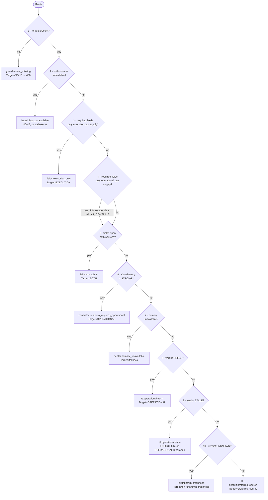

# TTL-Aware BFF — Routing Policy

Definitive description of `internal/router.DataSourceRouter`: the eleven-rule
chain, the TTL evaluation algorithm, clock-skew correction, the freshness probe,
decision truth tables, and the justification for a policy chain over branching
logic.

Requirement ids come from `spec/requirements.md`. Rule ids, config keys and enum
values come from `docs/DESIGN-CONTRACT.md` and are frozen.

---

## 1. Inputs to a routing decision

The router is a **pure function** (REQ-RT-004, REQ-RT-010):

```
Decision = Route(
    RequestType,          // from classifier (REQ-CLS-001)
    RequiredFields,       // FieldSet from the field catalog (REQ-CLS-003)
    Consistency,          // EVENTUAL | STRONG (REQ-CLS-004)
    Tenant,               // resolved from JWT (REQ-SEC-004)
    Verdict,              // FRESH | STALE | UNKNOWN + ageSeconds (REQ-TTL-002)
    HealthSnapshot,       // one read, reused for the entire chain (REQ-RT-010)
    EffectiveConfig,      // tenant overlay applied (REQ-CFG-002)
)
```

No I/O happens inside the chain. The freshness probe (§4) runs *before* the
chain and its result enters as `Verdict`; the health snapshot is read once and
frozen so no two rules can disagree about reality.

### 1.1 The `Decision` value

```go
type Target int // TargetNone | TargetOperational | TargetExecution | TargetBoth

type Decision struct {
    Target           Target
    Rule             string        // stable id, emitted as metric/trace attribute
    Reason           string        // human-readable, includes concrete values
    Primary          domain.SourceKind
    Fallback         domain.SourceKind
    OperationalTTL   time.Duration
    AllowStale       bool
    MaxStale         time.Duration
    PerSourceTimeout map[domain.SourceKind]time.Duration
    RequiredSources  map[domain.SourceKind]bool // false => optional (partial ok)
}
```

`Rule` is never empty (REQ-RT-002). `Reason` states the predicate that fired with
its operands, e.g. `operational age 41.2s > ttl 30.0s, allow_stale=false,
fallback=execution` (REQ-RT-005).

### 1.2 The field catalog

`internal/policy` owns the catalog. Each field group declares which source(s) can
supply it — this is what makes rules 3–5 decidable without endpoint-specific
code.

| Field group | Suppliable by | Notes |
|---|---|---|
| `status` | operational, execution | execution supplies it only while an execution is `RUNNING` |
| `subState` | operational, execution | ODS `substate`; overridden while running |
| `configuration` | operational | |
| `metrics` | operational | |
| `topology` | operational | |
| `owner` | operational | |
| `latestExecution` | execution | |
| `executionHistory` | execution | |
| `lastOperation` | execution | derived from the latest terminal execution |

`RequiredFields` per request type (REQ-CLS-003):

| RequestType | RequiredFields |
|---|---|
| `resource_read` | `status, subState, configuration, owner, topology` |
| `resource_status` | `status` — `subState` is deliberately **not** required; it is `omitempty` decoration no caller can depend on, and requiring it would make every answer from a source that does not model it look incomplete |
| `resource_configuration` | `configuration` |
| `execution_history` | `executionHistory` |
| `execution_status` | `latestExecution` |
| `resource_details` | `status, subState, configuration, owner, topology, metrics, latestExecution, lastOperation` |

---

## 2. The rule chain

Eleven rules, evaluated in order, **first match wins** (REQ-RT-001). Order encodes
a precedence of concerns:

```
correctness guards  →  availability  →  capability  →  consistency
                    →  availability (primary)  →  freshness  →  defaults
```



Rule 4 falls through rather than terminating: "only operational can supply these
fields" pins the *source set*, but which operational path is taken (fresh read,
stale-serve, refuse) is still decided by the health and TTL rules below it.

The reason it pins rather than terminates is a safety property, not an
optimisation. Terminating at rule 4 would skip the TTL rules, and with them the
`max_stale` ceiling — so a request type like `resource_configuration`, whose
fields no other source holds, would happily serve a record of any age. The
ceiling has to hold precisely for the request type that has nowhere else to go.

Pinning also **clears the fallback**. A fallback source that cannot supply the
requested fields is not a fallback, it is a wrong answer, so the pin sets
`fallback = none` and marks the decision pinned, which stops `Router.finish` from
re-attaching the configured fallback afterwards. Rules 8/9/10 downstream
therefore see `preferred = operational, fallback = none` and will either serve
the record, serve it as stale-but-permitted, or refuse.

Only the *terminating* rule id is emitted. When rule 4 pins the set and rule 8
fires, `meta.routingRule` reads `ttl.operational.fresh`. The id
`fields.operational_only` appears on the wire in exactly one case: the
operational source is unavailable, in which case rule 4 terminates with
`Target = NONE` and the ladder takes over.

Rule 3, `fields.execution_only`, **pins in exactly the same way and for the same
reason** — it clears the configured fallback so `finish()` cannot re-attach a
source that lacks the requested fields. Where it differs is that it *terminates*
on both branches: TTL semantics belong to the operational source, so once the
source set is the EDS there is nothing further for the chain to evaluate.

Either pin also constrains **rule 10**. An unknown freshness verdict may not be
resolved by crossing a pin to the other source, because that source cannot supply
the requested fields; if the pinned source is unavailable, rule 10 returns
`NONE`.

### Rule 1 — `guard.tenant_missing`

| | |
|---|---|
| **Inputs** | `Tenant` |
| **Predicate** | `Tenant == "" ` (no authenticated tenant claim resolved) |
| **Outcome** | `Target = NONE`, `Primary = NONE`, request fails `400 INVALID_REQUEST` (or `401`/`403` if authentication already failed upstream) |
| **Rule id** | `guard.tenant_missing` |
| **Requirements** | REQ-MT-001, REQ-SEC-004, REQ-EDGE-016 |

Fail closed. A tenant-less request cannot produce a cache key, cannot be sent to a
source, and cannot be attributed in telemetry — there is no safe default tenant.

**Worked example.** Internal caller reaches `/api/v1/resources/r-1` with a JWT
that authenticates but carries no `tenant_id` claim, and `required_claims`
enforcement was relaxed for a migration. Rule 1 fires. Response:
`400 INVALID_REQUEST`, `meta` absent (error envelope), audit event
`tenant_resolution_failed`. No source is contacted.

### Rule 2 — `health.both_unavailable`

| | |
|---|---|
| **Inputs** | `HealthSnapshot`, `AllowStale`, `MaxStale`, cache candidate |
| **Predicate** | `health[OPERATIONAL] ∈ {NOT_SERVING, UNKNOWN, CIRCUIT_OPEN}` **and** `health[EXECUTION] ∈ {NOT_SERVING, UNKNOWN, CIRCUIT_OPEN}` |
| **Outcome** | If `allow_stale` and a cache entry exists with `age ≤ max_stale`: `Target = NONE`, serve cached with `degraded = true`, warnings `STALE_DATA` + per-source states. Otherwise `Target = NONE` → `503 NO_SOURCE_AVAILABLE`. |
| **Rule id** | `health.both_unavailable` |
| **Requirements** | REQ-EDGE-005, REQ-RES-009, REQ-TTL-008 |

Placed second because there is no point evaluating capability, consistency or
freshness when nothing can be asked. It also guarantees that the expensive rules
below never run during a total upstream outage.

**Worked example.** ODS breaker `OPEN`, EDS returning connection-refused for 30 s
so its breaker is `OPEN` too. Tenant `acme` requests `/status`
(`allow_stale: true`, `max_stale: 120s`). L2 holds an entry with
`observedAt = now-38s`. Rule 2 fires, stale branch: `200`,
`meta.degraded = true`, `meta.freshness = {state: STALE, ageSeconds: 38.0,
ttlSeconds: 5}` (tenant override), `meta.cache = {hit: true, layer: "L2", ageMs: 38000}`,
`meta.routingRule = "degrade.stale_cache"` — the ladder's own id, stamped by
`Service.serveStale`, not rule 2's id — and one `STALE_DATA` warning.
`stale_response_total++`.

### Rule 3 — `fields.execution_only`

| | |
|---|---|
| **Inputs** | `RequiredFields`, field catalog |
| **Predicate** | `∀ f ∈ RequiredFields: suppliers(f) = {EXECUTION}` |
| **Outcome** | `Target = EXECUTION`, `Primary = EXECUTION`, **`Fallback` cleared to `none`** — the rule pins the source set, and a fallback that cannot supply the requested fields is a wrong answer rather than a fallback, so `finish()` must not re-attach the configured one. `RequiredSources = {execution: true}`. Terminates. |
| **Rule id** | `fields.execution_only` |
| **Requirements** | REQ-CLS-003, REQ-RT-007, REQ-EDGE-004 |

Capability precedes preference. No TTL on operational data can make the ODS able
to answer "what were the last 50 workflow runs".

**Worked example.** `GET /api/v1/resources/r-77/executions?limit=25`.
`RequiredFields = {executionHistory}`, suppliers = `{EXECUTION}`. Rule 3 fires.
`ttl: 0s` for `execution_history` means no cache and no stale-serve (REQ-TTL-010).
EDS is called with `call_timeout`. If EDS is down, the result is
`503 UPSTREAM_UNAVAILABLE` — substituting operational data would be a lie, not a
degradation.

### Rule 4 — `fields.operational_only`

| | |
|---|---|
| **Inputs** | `RequiredFields`, field catalog |
| **Predicate** | `∀ f ∈ RequiredFields: suppliers(f) ∋ OPERATIONAL` and `∄ f: suppliers(f) = {EXECUTION}` |
| **Outcome** | If the ODS is unavailable: `Target = NONE`, rule id `fields.operational_only`, ladder. Otherwise the source set is pinned to `{OPERATIONAL}`, **`Fallback` is cleared to `none`**, and evaluation continues — rules 8/9/10 produce the decision and their id is what `meta.routingRule` reports. `fields.operational_only` is never emitted with `Target = OPERATIONAL`. |
| **Rule id** | `fields.operational_only` |
| **Requirements** | REQ-CLS-003, REQ-RT-001 |

**Worked example.** `GET /api/v1/resources/r-9/configuration`.
`RequiredFields = {configuration}`, suppliers = `{OPERATIONAL}`. The set is
pinned and the fallback is cleared — `resource_configuration` is configured
`fallback: none` anyway, but the pin would clear a configured one too, because
the EDS cannot supply `configuration`. If the ODS is unavailable, rule 4 itself
terminates with `Target = NONE` and the ladder goes cache → stale cache → `503`.
With the ODS healthy, `ttl: 30s` and a probe reporting `age = 8.2s`, rule 8 fires
and the emitted rule id is `ttl.operational.fresh` — **not**
`fields.operational_only`. That is the single most common misreading of this
chain.

### Rule 5 — `fields.span_both`

| | |
|---|---|
| **Inputs** | `RequiredFields`, field catalog, `required_sources` config |
| **Predicate** | `∃ f: suppliers(f) = {OPERATIONAL}` **and** `∃ g: suppliers(g) = {EXECUTION}` |
| **Outcome** | `Target = BOTH`, `Primary` = configured `preferred_source` (`both` → operational for freshness purposes), `RequiredSources` from `routing.request_types.<type>.required_sources` |
| **Rule id** | `fields.span_both` |
| **Requirements** | REQ-AGG-001, REQ-RT-007, REQ-EDGE-018 |

**Worked example.** `GET /api/v1/resources/r-3/details`. Required fields include
`configuration` (operational-only) and `latestExecution` (execution-only). Rule 5
fires. Contract config gives `required_sources: {operational: true, execution:
false}`. Fan-out dispatches both with `PerSourceTimeout{operational: 150ms,
execution: 400ms}`. EDS times out ⇒ `200`, `partial = true`, warning
`SOURCE_TIMEOUT`, `provenance` omits `latestExecution` and
`lastOperation`. ODS times out ⇒ required group missing ⇒ `206` if any group
survived, else the ladder.

### Rule 6 — `consistency.strong_requires_operational`

| | |
|---|---|
| **Inputs** | `Consistency`, source set from rules 3–5 |
| **Predicate** | `Consistency == STRONG` and `OPERATIONAL ∈ source set` |
| **Outcome** | `Target = OPERATIONAL`, `AllowStale = false`, cache read bypassed (REQ-CACHE-006), stale-serve forbidden regardless of `allow_stale` config |
| **Rule id** | `consistency.strong_requires_operational` |
| **Requirements** | REQ-CLS-004, REQ-CACHE-006, REQ-TTL-008 |

`STRONG` is produced by `?consistency=strong` on the request, or by
`consistency: strong` on the request type (which is how `allow_stale: false` is
expressed for `execution_status` and `execution_history`). There is no
`Cache-Control: no-cache` handling on the request path. It is a *client-visible
correctness contract*: the caller is told nothing older than a live read.

The cache bypass is enforced in `application.Service.load`, which calls the
loader directly instead of `Manager.GetOrLoad` when the classification is
`STRONG`, then writes the result back through `Manager.Store`. So the read is
skipped but the write is not — a strongly-consistent request still populates the
cache for callers at weaker levels — and `meta.cache.hit` is always `false` for
such a request.

**Worked example.** A remediation console calls
`GET /api/v1/resources/r-12/status?consistency=strong` before issuing
a destructive action. Classifier yields `Consistency = STRONG`. Rule 6 fires.
Cache is not read. The probe is skipped as an optimisation is *not* permitted —
the full read is performed unconditionally, and `meta.freshness.ageSeconds`
reflects the live observation. If the ODS is unavailable, the request fails
`503`; no stale answer is acceptable here.

### Rule 7 — `health.primary_unavailable`

| | |
|---|---|
| **Inputs** | `HealthSnapshot`, `Primary`, `Fallback` |
| **Predicate** | `health[Primary] ∈ {NOT_SERVING, UNKNOWN, CIRCUIT_OPEN}` **and** `Fallback != NONE` **and** `Fallback` can supply the required fields **and** `health[Fallback] = SERVING|DEGRADED` |
| **Outcome** | `Target = Fallback` (single hop, REQ-RT-008); `execution_fallback_total++` when the fallback is EXECUTION |
| **Rule id** | `health.primary_unavailable` |
| **Requirements** | REQ-EDGE-003, REQ-RT-008, REQ-RES-006 |

Health is read from the background poller's snapshot plus breaker state — never
by an inline health RPC (REQ-DS-006). This is what makes the fallback decision
happen *before* dispatch, so no doomed call is issued.

`preferred_source: both` is matched on the **configured string**, not on the
parsed `SourceKind`. "both" is not a member of `SourceKind` and parses to none,
so testing the parsed value would make the rule return "not applicable" for every
`both` request type and the one-side-healthy degradation branch below would be
unreachable.

**Worked example.** ODS breaker trips after 12 consecutive `UNAVAILABLE`
responses. `resource_read` has `fallback: execution`. Rule 7 fires:
`Target = EXECUTION`. The EDS can supply `status` (via latest execution) but not
`configuration` or `topology`; those groups are absent, so the response is `206`
with `partial = true`, provenance `{status: EXECUTION}`, warnings
`SOURCE_UNAVAILABLE{source: OPERATIONAL}`. `meta.degraded = true`
because a fallback source was used.

### Rule 8 — `ttl.operational.fresh`

| | |
|---|---|
| **Inputs** | `Verdict`, `OperationalTTL` |
| **Predicate** | `Verdict.State == FRESH`, i.e. `correctedAge ≤ effectiveTTL` |
| **Outcome** | `Target = OPERATIONAL`, `degraded = false`; **the EDS is not called** |
| **Rule id** | `ttl.operational.fresh` |
| **Requirements** | REQ-EDGE-001, REQ-TTL-002, REQ-OBS-008 |

`operational_ttl_hit_total++`. This is the path the whole system is optimised
for: one cheap probe plus one low-latency gRPC read, and the expensive REST
source is never touched.

**Worked example.** `resource_status`, `ttl: 10s`. Probe returns
`last_updated = 12:00:03.100Z`, `server_time = 12:00:09.400Z` ⇒
`age = 6.3s ≤ 10s`. Rule 8 fires. `GetResourceState` is called (the narrow RPC,
not the full read). Response `200`, `meta.routingRule = "ttl.operational.fresh"`,
`meta.sources = ["OPERATIONAL"]`, `meta.freshness = {state: "FRESH",
ageSeconds: 6.3, ttlSeconds: 10, observedAt: "2026-…T12:00:03.100Z"}`.

### Rule 9 — `ttl.operational.stale`

| | |
|---|---|
| **Inputs** | `Verdict`, `AllowStale`, `MaxStale`, `Fallback` |
| **Predicate** | `Verdict.State == STALE`, i.e. `correctedAge > effectiveTTL` |
| **Outcome** | Branching: (a) `Fallback = EXECUTION` and it can supply the required fields ⇒ `Target = EXECUTION`, `execution_fallback_total++`; (b) `AllowStale` and `age ≤ MaxStale` ⇒ `Target = OPERATIONAL`, `degraded = true`, warning `STALE_DATA`, `stale_response_total++`; (c) neither ⇒ continue the degradation ladder, ultimately `503` |
| **Rule id** | `ttl.operational.stale` |
| **Requirements** | REQ-EDGE-002, REQ-TTL-008 |

Branch order is (a) then (b): a *current* answer from the slower source beats a
*stale* answer from the fast one when the slower source can actually supply the
fields. When it cannot — `configuration`, `topology` — only (b) is reachable.

**Worked example (a).** `resource_read`, `ttl: 30s`, probe age `47.5s`,
`fallback: execution`, EDS `SERVING`. Rule 9 branch (a):
`Target = EXECUTION`. The EDS answers `status` and `lastOperation`; operational-only
groups are absent ⇒ `206 partial`, `degraded = true`.

**Worked example (b).** `resource_configuration`, `ttl: 30s`, `fallback: none`,
`allow_stale: true`, `max_stale: 300s`, probe age `112s`. Branch (a) impossible.
Branch (b): `Target = OPERATIONAL`, full read performed, `200`,
`degraded = true`, `freshness = {state: "STALE", ageSeconds: 112.0,
ttlSeconds: 30}`, warning `STALE_DATA`.

**Worked example (c).** Same as (b) but age `410s > max_stale 300s`. The
operational data is discarded (REQ-TTL-008). Ladder: no fallback, no fresh cache,
no in-bound stale cache ⇒ `503 NO_SOURCE_AVAILABLE`.

**An unverified age counts as beyond the ceiling.** A request type with `ttl: 0s`
issues no freshness probe — it will not accept an age-based answer, so there is
nothing to learn from one — which means no age was measured. Branch (b) therefore
refuses rather than treating an unmeasured age as zero: the ceiling is a safety
property, and "we did not measure" is not evidence that it holds.

### Rule 10 — `ttl.unknown_freshness`

| | |
|---|---|
| **Inputs** | `Verdict`, `routing.defaults.on_unknown_freshness` |
| **Predicate** | `Verdict.State == UNKNOWN` — probe failed, probe not attempted, source omitted `last_updated`, or gross clock skew detected |
| **Outcome** | `Target = on_unknown_freshness` ∈ `operational` (default) \| `execution` \| `none`. `none` is **honoured**: the rule returns `Target = NONE` and the ladder runs, ending in `503 NO_SOURCE_AVAILABLE` if no stale candidate exists. Only an *unparseable* value falls back to `operational`. If the chosen source is down, the rule tries the other one — unless a field rule pinned the set, in which case it returns `NONE` rather than routing to a source that cannot answer. |
| **Rule id** | `ttl.unknown_freshness` |
| **Requirements** | REQ-TTL-005, REQ-TTL-007, REQ-EDGE-010 |

**Why `none` is honoured rather than normalised.** An operator who wrote `none`
chose to fail rather than guess, and that is a different thing from having written
nothing at all. Silently rewriting it to `operational` would hand the most
optimistic behaviour to precisely the tenant who opted out of optimism. Only a
value that does not parse at all falls back, because there the operator's
intention is genuinely unknown and refusing every request would be a worse
failure than guessing (REQ-TTL-006).

**Design note on the default.** `operational` is the default because an unknown
verdict most often means "the probe was slow", not "the data is old". Routing to
the ODS optimistically costs one low-latency read; routing to the EDS
pessimistically costs a high-latency read on *every* probe hiccup, which converts
a 120 ms probe timeout into a systemic latency regression. Tenants with strict
freshness needs set `on_unknown_freshness: execution`; tenants that would rather
fail than guess set `none`.

The response for this path reports `freshness.state = UNKNOWN`.

`ageSeconds` is **not** omitted: `domain.Freshness.MarshalJSON` emits it
unconditionally, so an unknown verdict is published as
`{state: UNKNOWN, ageSeconds: 0, ttlSeconds: <ttl>}`. `state` is what carries the
"could not be established" fact; a client that reads `ageSeconds` without
checking `state` will misread a zero as "brand new" (REQ-API-005).

**Worked example.** Probe exceeds `freshness_probe_timeout: 120ms`. Verdict
`UNKNOWN`. `on_unknown_freshness: operational`. Rule 10 fires: `Target =
OPERATIONAL`, full read succeeds in 45 ms. Response `200`,
`meta.routingRule = "ttl.unknown_freshness"`,
`meta.freshness = {state: "UNKNOWN", ageSeconds: 0, ttlSeconds: 30, observedAt: <from the full
read's envelope>}`. Note the full read carries its own `FreshnessEnvelope`, so
`observedAt` is populated even though the pre-decision verdict was unknown —
`state` remains `UNKNOWN` because the *decision* was made without freshness
knowledge, and the meta describes the decision, not a post-hoc recomputation.

### Rule 11 — `default.preferred_source`

| | |
|---|---|
| **Inputs** | `routing.request_types.<type>.preferred_source` |
| **Predicate** | always true (chain terminator, REQ-RT-002) |
| **Outcome** | `Target` = `preferred_source` mapped to `OPERATIONAL \| EXECUTION \| BOTH` |
| **Rule id** | `default.preferred_source` |
| **Requirements** | REQ-RT-002 |

Reachable only when the request type has `ttl: 0` (no freshness branch applies,
though REQ-TTL-002 forces `STALE` for `ttl: 0`, so in practice rule 9 catches it)
or when a future request type is added without freshness semantics. Its existence
is what makes the chain total; a `Decision` with an empty `Rule` is a defect
caught by `TestRouter_AlwaysEmitsRuleID`.

**Worked example.** A hypothetical `resource_labels` type is added with
`preferred_source: operational`, `ttl: 0s`, `cache_ttl: 0s` and no fallback. If a
future refactor made rule 9 conditional on `ttl > 0`, rule 11 would still
terminate the chain with `Target = OPERATIONAL` rather than returning a decision
with no rule id.

---

## 3. TTL evaluation algorithm

Owned by `internal/freshness`. Two entirely separate quantities are involved and
must never be conflated (REQ-TTL-001):

| Quantity | Config key | Meaning | Owner |
|---|---|---|---|
| **Source freshness TTL** | `routing.request_types.<t>.ttl` | how old the *source's observation* may be and still count as current | routing |
| **Cache TTL** | `routing.request_types.<t>.cache_ttl` | how long the BFF may reuse its own computed response | cache |

`cache_ttl < ttl` in every contract default. That is not a coincidence: the cache
must expire before the data it holds becomes stale, otherwise a cache hit would
routinely serve data whose freshness verdict has already flipped. Even so, a
cache hit is **always** re-evaluated against its stored `observedAt`
(REQ-CACHE-009) — the cache is never permitted to assert freshness on its own
authority.

### 3.1 Effective TTL resolution (REQ-TTL-003)

```
effectiveTTL = tenants.<tenant>.routing.request_types.<type>.ttl
            ?? routing.request_types.<type>.ttl
            ?? routing.defaults.ttl
```

Reported to the client as `meta.freshness.ttlSeconds` so the freshness verdict is
auditable from the response alone.

### 3.2 Age computation and clock-skew correction (REQ-TTL-004, REQ-EDGE-010)

The `FreshnessEnvelope` carries both `last_updated` and `server_time`. Both are
produced by the **source's** clock. The correct age is therefore computable
without involving the BFF's clock at all:

```
                 ┌── PREFERRED: single clock domain ──┐
if server_time present:
    age = server_time − last_updated
    skewEstimate = bff_now − server_time        // observational only
    if |skewEstimate| > clock_skew_tolerance:
        warn CLOCK_SKEW_DETECTED (skew = skewEstimate)
    if |skewEstimate| > 10 × clock_skew_tolerance:
        return UNKNOWN                          // source clock is not trustworthy

                 ┌── FALLBACK: two clock domains ──┐
else:
    rawAge = bff_now − last_updated
    age    = rawAge − clamp(skewEstimate, −tol, +tol)   // last known skew, clamped
    // when no skew estimate exists, tol is subtracted conservatively:
    //   age = rawAge − tol   (bias toward "older", never toward "fresher")

                 ┌── COMMON ──┐
if age < 0:
    warn CLOCK_SKEW_DETECTED
    age = 0
if last_updated is zero/absent:
    return UNKNOWN
```

Three properties are load-bearing:

1. **Same-domain subtraction is exact.** `server_time − last_updated` is immune to
   any offset between the BFF and the source, because the offset cancels.
2. **The fallback is biased toward staleness.** When forced into two-clock
   arithmetic, tolerance is subtracted so that borderline data is judged *older*
   than measured. A source running 10 s fast must never make 40 s-old data pass a
   30 s TTL (REQ-EDGE-010). Bias toward stale costs an unnecessary fallback; bias
   toward fresh serves wrong data silently.
3. **Negative age is a signal, not a value.** `age < 0` means the clocks disagree
   in the other direction. It is clamped to 0 and warned, never propagated as a
   negative `ageSeconds` in the envelope.

`clock_skew_tolerance` default is `2s` (`routing.defaults.clock_skew_tolerance`).

### 3.3 Verdict function (REQ-TTL-002)

```
verdict(age, ttl):
    if age is UNDEFINED            → UNKNOWN
    if ttl == 0                    → STALE      // "always live": no fresh branch
    if age ≤ ttl                   → FRESH
    else                           → STALE
```

`ttl == 0` deliberately yields `STALE` rather than `UNKNOWN`. `UNKNOWN` routes via
rule 10 (`on_unknown_freshness`), which for `execution_history` would be wrong —
`STALE` routes via rule 9, which correctly directs to the live source. Config
validation additionally forbids `ttl: 0` with `cache_ttl > 0` (REQ-TTL-010).

### 3.4 Stale bound (REQ-TTL-008)

Stale data may be served only when `allow_stale = true` **and**
`age ≤ max_stale`. Beyond `max_stale` the payload is discarded as if the source
had returned nothing. Without this bound, `allow_stale` silently converts the
cache into an archive of arbitrarily wrong answers during a long outage.

### 3.5 Multi-source freshness (REQ-EDGE-009)

For a `BOTH` response, `meta.freshness` reports the **oldest** contributing
observation. Reporting the newest would let a 2-second-old execution record mask
a 90-second-old operational record and overstate the confidence of the whole
envelope. Per-source observation times remain available in the provenance detail.

---

## 4. The freshness probe

### 4.1 Why a dedicated probe RPC exists

The routing decision needs exactly one fact about the operational source: *how
old is its record for this resource*. Obtaining that fact by performing the full
read defeats the purpose — the full read is the cost being avoided (REQ-RT-003).

| Property | `GetResource` (full read) | `GetResourceFreshness` (probe) |
|---|---|---|
| Payload | full resource: config map, metric samples, topology, labels | 3 scalars + 2 timestamps |
| Typical wire size | 2–40 KiB | < 200 B |
| Source-side cost | index lookup + hydrate + serialize all sub-records | index lookup on the freshness column |
| Target P95 | ≤ 45 ms | ≤ 15 ms (REQ-PERF-002) |
| Timeout key | `sources.operational.call_timeout` | `sources.operational.freshness_probe_timeout` (120 ms) |
| Failure semantics | request-affecting | verdict `UNKNOWN`, never fails the request |

If the probe were not materially cheaper than the read, the design would be
worthless — a request would pay probe + read on every miss. `TestPerf_ProbeCheaperThanRead`
(REQ-PERF-002) is therefore a hard gate, not a nice-to-have: it asserts the
economic premise of the whole system.

### 4.2 Probe policy

| Aspect | Behaviour | Req |
|---|---|---|
| When issued | request type has `preferred_source: operational` (or `both`) **and** `ttl > 0` **and** no valid probe memo | REQ-RT-003 |
| When skipped | `Consistency = STRONG` (full read is unconditional), `ttl = 0`, source set is execution-only, ODS unhealthy (rule 2/7 decide first) | REQ-CLS-004 |
| Timeout | `freshness_probe_timeout`, strictly `< call_timeout` | REQ-TTL-005 |
| Retry | **none** — a retry would cost more than the read it protects | REQ-RES-003 |
| Failure | verdict `UNKNOWN` → rule 10; counted in `operational_ttl_miss_total`; does **not** feed the breaker as a hard failure | REQ-TTL-005 |
| Memo | in-request always; cross-request for `min(cache_ttl, 1s)` keyed `(tenant, resourceId)` | REQ-TTL-006 |
| Memo content | the **observation** (`last_updated`, `server_time`, `version`), never the verdict | REQ-TTL-006 |
| Span | `bff.route`, carrying `routing_target`, `routing_rule` and `freshness` (the verdict). There is no separate probe span — the probe is metered, not traced | REQ-OBS-003 |

**Memoizing the observation, not the verdict**, is the subtle part. A cached
verdict stops ageing: an entry computed as `FRESH` at `t=0` with `age = 9.8s`
against a 10 s TTL would still report `FRESH` at `t=5s`, when the true age is
`14.8s`. Storing the observation and recomputing against the current clock keeps
the memo honest (REQ-TTL-006).

### 4.3 Probe amortisation

For a hot resource under `resource_status` (`cache_ttl: 3s`), the memo bound is
`min(3s, 1s) = 1s`, so probe traffic to the ODS is capped at 1 RPS per
(tenant, resource) per replica regardless of inbound request rate. Combined with
the L1/L2 cache serving most reads outright, steady-state ODS probe load is
`≈ R × (1 − h)` bounded above by `replicas × hot_resource_count` (see
`spec/architecture.md` §10).

---

## 5. Decision truth tables

### 5.1 Freshness × Health × Required-fields (operational-capable request types)

`OPS` = operational health, `EXE` = execution health.
`SERVING` and `DEGRADED` both count as available; `NOT_SERVING`, `UNKNOWN` and
`CIRCUIT_OPEN` count as unavailable.

| # | Fields need | OPS | EXE | Verdict | Consistency | Rule fired | Target | degraded | partial |
|---|---|---|---|---|---|---|---|---|---|
| 1 | ops-only | up | up | FRESH | EVENTUAL | `ttl.operational.fresh` | OPERATIONAL | no | no |
| 2 | ops-only | up | up | STALE | EVENTUAL | `ttl.operational.stale` (b) | OPERATIONAL | **yes** | no |
| 3 | ops-only | up | up | UNKNOWN | EVENTUAL | `ttl.unknown_freshness` | OPERATIONAL | no | no |
| 4 | ops-only | down | up | any | EVENTUAL | `health.primary_unavailable`¹ | fallback or ladder | yes | maybe |
| 5 | ops-only | down | down | any | any | `health.both_unavailable` | NONE / stale cache | yes | maybe |
| 6 | ops-only | up | any | any | STRONG | `consistency.strong_requires_operational` | OPERATIONAL | no | no |
| 7 | exe-only | up | up | n/a | any | `fields.execution_only` | EXECUTION | no | no |
| 8 | exe-only | up | down | n/a | any | `fields.execution_only` → dispatch fails | EXECUTION | — | — → 503 |
| 9 | both | up | up | FRESH | EVENTUAL | `fields.span_both` | BOTH | no | no |
| 10 | both | up | down | any | EVENTUAL | `fields.span_both` | BOTH (exec optional) | no | **yes** |
| 11 | both | down | up | any | EVENTUAL | `fields.span_both` | BOTH (ops required fails) | yes | yes → 206 |
| 12 | both | down | down | any | EVENTUAL | `health.both_unavailable` | NONE / stale cache | yes | yes |
| 13 | ops-only | up | up | STALE | EVENTUAL | `ttl.operational.stale` (a)² | EXECUTION | yes | yes |
| 14 | ops-only | up | up | STALE, age > max_stale | EVENTUAL | `ttl.operational.stale` (c) | ladder → 503 | yes | — |
| 15 | any | — (no tenant) | — | — | — | `guard.tenant_missing` | NONE → 400 | — | — |

¹ Fires only when `fallback != none` and the fallback can supply the fields;
otherwise the ladder (cache → stale cache → 503) applies with rule id
`health.primary_unavailable` still emitted.
² Only when `fallback: execution` **and** EDS can supply the required fields —
i.e. `status`/`lastOperation`, not `configuration`/`topology`.

### 5.2 Freshness verdict from probe outcome

| Probe outcome | `last_updated` | `server_time` | Verdict | Rule |
|---|---|---|---|---|
| OK | present | present | FRESH/STALE per §3.3 | 8 or 9 |
| OK | present | absent | FRESH/STALE with clamped skew, biased older | 8 or 9 |
| OK | zero/absent | any | UNKNOWN | 10 |
| OK, `found = false` | — | — | not-found path → `404` (negatively cached) | — |
| Timeout | — | — | UNKNOWN | 10 |
| Transport error | — | — | UNKNOWN | 10 |
| Gross skew (>10× tolerance) | present | present | UNKNOWN + warning | 10 |
| Skipped (`ttl = 0`) | — | — | STALE by construction | 9 |
| Skipped (`STRONG`) | — | — | n/a — full read unconditional | 6 |

### 5.3 Stale-serve admission

| `allow_stale` | `age ≤ max_stale` | `Consistency` | Outcome |
|---|---|---|---|
| true | yes | EVENTUAL | serve, `degraded = true`, `STALE_DATA` |
| true | no | EVENTUAL | discard; continue ladder |
| true | yes | STRONG | **discard** — STRONG overrides `allow_stale` |
| false | — | any | discard; continue ladder |

### 5.4 Required vs optional source failure (for a dispatched decision)

| Source | `RequiredSources[s]` | Failure | Response |
|---|---|---|---|
| operational | true | timeout/unavailable | ladder; if a group survives ⇒ `206 partial`; else `503`/`504` |
| operational | false | any | `200`, `partial = true`, warning |
| execution | true | timeout/unavailable | `503`/`504` (no operational substitution permitted) |
| execution | false | any | `200`, `partial = true`, warning |
| either | any | invalid payload | `UPSTREAM_INVALID_RESPONSE`; optional ⇒ partial, required ⇒ error |
| either | any | schema major mismatch | source marked unavailable; fallback may still serve |

---

## 6. Configuration surface driving the chain

```yaml
routing:
  defaults:
    on_unknown_freshness: operational   # rule 10 target
    clock_skew_tolerance: 2s            # §3.2
    allow_stale: true
    max_stale: 5m
  request_types:
    resource_status:        { preferred_source: operational, ttl: 10s, cache_ttl: 3s,  fallback: execution, allow_stale: true,  max_stale: 120s }
    resource_configuration: { preferred_source: operational, ttl: 30s, cache_ttl: 15s, fallback: none,      allow_stale: true,  max_stale: 300s }
    resource_read:          { preferred_source: operational, ttl: 30s, cache_ttl: 5s,  fallback: execution, allow_stale: true,  max_stale: 300s }
    execution_status:       { preferred_source: execution,   ttl: 5s,  cache_ttl: 2s,  fallback: none,      allow_stale: false }
    execution_history:      { preferred_source: execution,   ttl: 0s,  cache_ttl: 0s,  fallback: none,      allow_stale: false }
    resource_details:       { preferred_source: both,        ttl: 30s, cache_ttl: 5s,  fallback: operational, allow_stale: true, max_stale: 300s,
                              required_sources: { operational: true, execution: false } }
```

Every one of these values is reachable by environment override
(`BFF_ROUTING__REQUEST_TYPES__RESOURCE_STATUS__TTL`) and by tenant overlay
(`tenants.acme.routing.request_types.resource_status.ttl`). None of them appears
as a literal in Go source (REQ-CFG-001).

**Reading the defaults as policy statements:**

- `resource_status` has the shortest TTL (10 s) and the shortest cache (3 s)
  because status is the field users watch change. It has a fallback because a
  stale-but-live execution view of status is better than nothing.
- `resource_configuration` has `fallback: none` because the EDS structurally
  cannot supply configuration; a fallback would be a lie.
- `execution_history` has `ttl: 0` and `cache_ttl: 0` — always live. History is
  append-only and cheap to be wrong about only in the direction of missing the
  newest entry, which is exactly what users notice.
- `execution_status` has `allow_stale: false` because a stale execution status is
  actively dangerous (a user may believe a run finished when it is still going).
- `resource_details` makes execution optional so the heavy endpoint degrades to
  a fast operational-only answer rather than inheriting the EDS latency profile
  as a hard dependency.

---

## 7. Why this is policy-driven, not if/else

This is the central design decision of the service, so it is argued rather than
asserted.

**The combinatorial argument.** The decision space is
`6 request types × 3 freshness verdicts × 3 health states² × 2 consistency levels
× 2 allow_stale × (fallback ∈ {none, ops, exec})`. Written as nested conditionals
in handlers, that is several hundred reachable paths spread across six functions,
with no mechanism preventing two handlers from disagreeing about, say, whether a
stale-but-within-`max_stale` operational record beats a live execution record.
The rule chain reduces the same space to **eleven predicates evaluated once**,
each independently testable, with a proof obligation (`TestRouter_ChainOrder`,
`TestRouter_FirstMatchWins`) that ordering is what the spec says.

**The observability argument.** A branch in an `if` statement has no name. A rule
has a **stable id** that is emitted as a metric attribute
(`routing_decision_total{routing_rule="ttl.operational.stale"}`), a span attribute
and a log field. During an incident the question "why did we call the slow source
1000× more this hour?" is answered by a single `group by routing_rule` query.
With branching logic the same question requires reading code and guessing. Rule
ids are frozen strings in the contract precisely so that dashboards and alerts
survive refactoring.

**The configurability argument.** REQ-CFG-001 forbids compiled-in TTLs. A chain
whose predicates read from an immutable config snapshot supports per-tenant
overrides and hot reload with no code change: tenant `acme` gets
`resource_status.ttl: 5s` by adding four lines of YAML. Branching logic pushes
tenant variation into the branches themselves, where it multiplies rather than
overlays.

**The testability argument.** The chain is a pure function of a value struct
(REQ-RT-004, REQ-RT-010). Its tests are tables of `(inputs) → (rule id, target,
flags)` with no fakes, no HTTP, no gRPC and no clocks. `TestRouter_AlwaysEmitsRuleID`
is a property test over randomized inputs proving totality — a property that
cannot even be stated about a tree of conditionals.

**The extensibility argument.** Adding a rule (e.g. `cost.budget_exceeded` to
suppress the expensive source under a spend cap) is an insertion at a known
position plus a row in the truth table. Adding the same behaviour to branching
logic means auditing every existing branch for interaction.

**The auditability argument.** `Decision` is a value that is logged verbatim
(REQ-RT-005). A support engineer reading
`rule=ttl.operational.stale reason="operational age 47.5s > ttl 30.0s,
allow_stale=false, fallback=execution" target=EXECUTION` needs no source access to
reconstruct what happened. This is the difference between a system that can be
operated by people who did not write it and one that cannot.

**What is deliberately not policy-driven.** The *order* of the chain is fixed in
code, not configuration. Making order configurable would allow operators to
construct incoherent policies (e.g. freshness evaluated before the tenant guard)
and would make the truth tables in §5 unverifiable. Configuration varies the
*parameters* of the rules; the code owns their *sequence*.

### Clarification: rule 4 pins, rule 3 terminates, rule 11 is a backstop

**Rule 3 (`fields.execution_only`) pins AND terminates.** It pins for the same
reason rule 4 does — clearing the configured fallback so a source that cannot
supply the requested fields can never be re-attached by `finish()` — and then
terminates, because TTL semantics belong to the operational source and there is
nothing further to evaluate once the answer can only come from the EDS. No probe
is issued.

**Rule 4 (`fields.operational_only`) PINS the source set and falls through** to
the TTL rules, which then emit the rule id. Terminating at rule 4 would skip the
`max_stale` ceiling, so a request type whose fields no other source holds --
`resource_configuration` is the shipped example -- would serve a record of any
age. The ceiling is a safety property, not an optimisation, and it has to hold
precisely where there is nowhere else to go. Pinning also clears the configured
fallback: a fallback source that cannot supply the requested fields is not a
fallback, it is a wrong answer.

The observable consequence is that a `/configuration` response reports
`routingRule: ttl.operational.fresh` (or `.stale`), never
`fields.operational_only`. The `fields.operational_only` id appears only when
that rule refuses outright, because the one source that could answer is
unavailable.

**Either pin binds rule 10.** An unknown freshness verdict is normally resolved
by trying the other source when the configured one is down. A pinned set forbids
that: the other source cannot supply the requested fields, so rule 10 returns
`NONE` instead of producing an answer that is wrong rather than merely old.

**`guard.unconfigured_request_type` is a pre-chain exit, not a rule.** It is taken
in `Select` before any rule runs, when `ResolveRule` finds no entry for the
request type. That is a deployment defect rather than a routing outcome, and it is
reported through `OnDecision` — so it lands in `routing_decision_total` alongside
every real decision, where an operator will actually see it, instead of only in a
log line. Alert on any non-zero rate.

**Rule 11 (`default.preferred_source`) is unreachable for the six shipped
request types.** The field catalogue routes each of them through rules 3, 5, 8,
9 or 10 first — rule 4 pins but never produces a decision on the healthy path. Rule 11 exists as the chain's terminating guarantee -- the
chain must always produce a decision -- and as the landing point for a request
type added later whose fields do not constrain the source set. Seeing it in
`routing_decision_total` is worth alerting on: it means a request type reached
the end of the chain without any rule having an opinion, which is almost always
a configuration gap.
